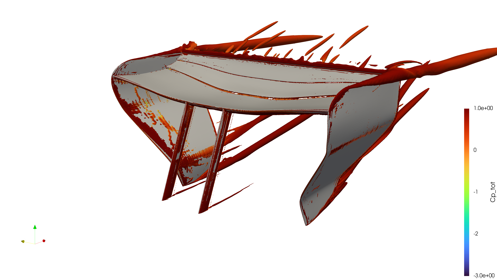
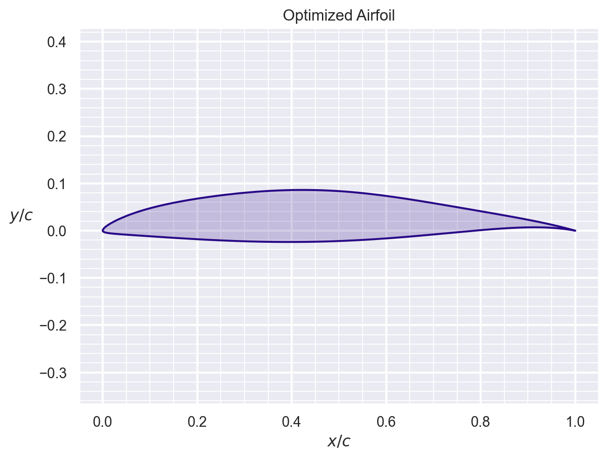
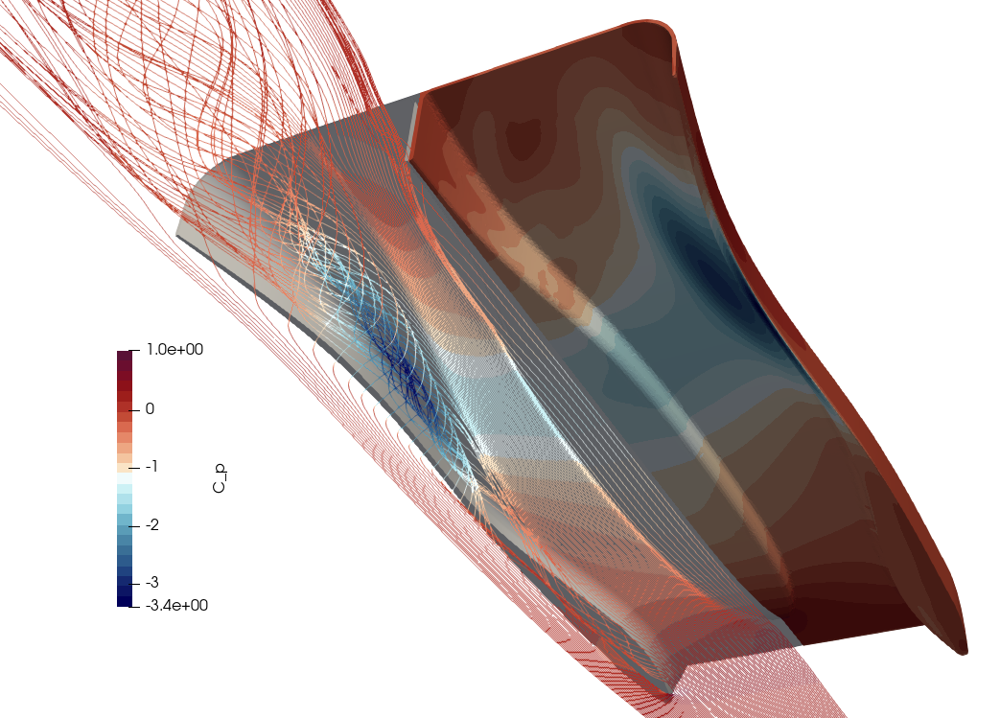
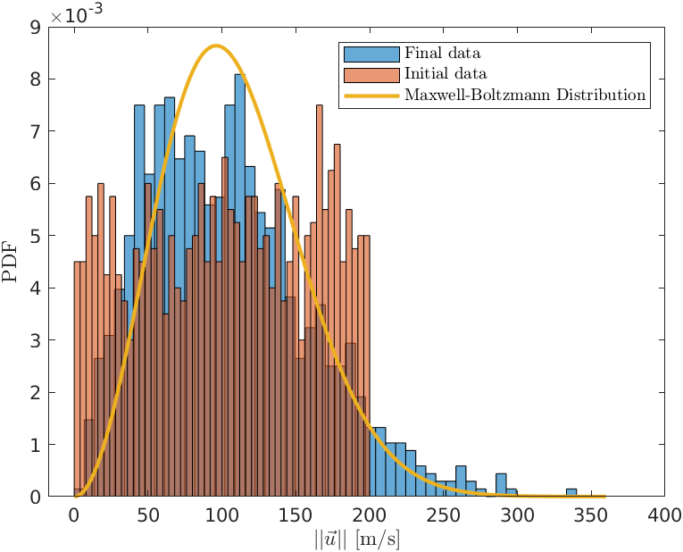
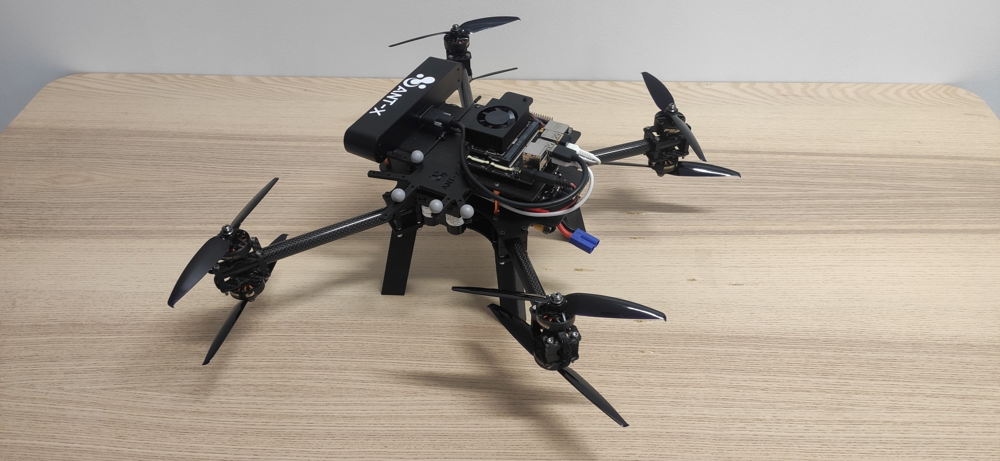

::: {.column-screen .bg-primary .text-white .text-center style="padding: 60px 20px; margin-top: -30px; margin-bottom: 40px;"}
# CFD Portfolio
### CFD Simulations | OpenFOAM | AWS Cloud Computing | Code Development
:::

## Featured Projects

::: {layout-nw="[[1,1,1]]"}

::: {.card .text-center}
### 2026 F1 Rear Wing

Development of a 2026 F1 Rear Wing using OpenFOAM, including SLM pivot point optimization.
[View Project >](rear_wing.qmd){.btn .btn-outline-primary .btn-sm}
:::

::: {.card .text-center}
### PoliMi Master Thesis

Development of automatic differentiation for hydrofoil optimization.
[View Project >](thesis.qmd){.btn .btn-outline-primary .btn-sm}
:::

::: {.card .text-center}
### Ground Effect Floor CFD Analysis

Various parameters on floor and diffuser effectiveness are studied in OpenFOAM. Strakes are then added to investiagate their role in modern racing vehicles.
[View Project >](floor.qmd){.btn .btn-outline-primary .btn-sm}
:::

::: {.card .text-center}
### Entropy & Statistical Mechanics

Entropy is said to introduce the arrow of time as an emerging property of reality, can a simulation of statistical mechanics help uncover more of this topic?
[View Project >](entropy.qmd){.btn .btn-outline-primary .btn-sm}
:::

::: {.card .text-center}
### Control Systems

Development of a PID controller for a small quad-rotor UAV, providing stability and robust performance in attitude and position.
[View Project >](control_system.qmd){.btn .btn-outline-primary .btn-sm}
:::

::: {.card .text-center}
### Resume
My resume so far
[View Project >](resume.qmd){.btn .btn-outline-primary .btn-sm}
:::

:::

## Future projects
Ideas for future CFD investigations include:

* full C++ development & validation of a transition + turbulence model, from literature, in OpenFOAM
* aerostructural wing development, through FSI simulations

## About Me
I am a Aeronautical Engineer specializing in high-performance scientific computing, CFD and aerodynamics. This portfolio showcases my work in simulating the next generation of Formula 1 regulations using OpenFOAM and AWS high-performance computing clusters, and some academic projects I had the privilege to work on during my time at Politecnico di Milano.

  <a href="mailto:michele.andreozzi@protonmail.com" class="btn btn-primary btn-lg">
    <i class="bi bi-envelope"></i> Get In Touch
  </a>

