::: {.callout-note icon=false appearance="simple"}
## Abstract
This report presents the aerodynamic development of a 2026 Formula 1 rear wing using Computational Fluid Dynamics simulations. Fourteen different geometries were investigated using OpenFOAM, evaluating lift coefficient, drag coefficient, lift-to-drag ratio, and field values analysis, such as pressure coefficient and wall bounded streamlines. The study intends to both evaluate the usage of CFD as a reliable method for aerodynamic performance prediction and to also prove a broad understanding of the current F1 ruleset regarding the rear wing.
:::

## Introduction

The 2026 Formula 1 regulations introduce significant changes to rear wing design: traditional endplates are brought back, but a very tight RV-RW-PROFILES reference volume is introduced, and the evolution from DRS to SLM for straight line drag reduction forces aerodynamic engineers to explore new development paths.

This study is developed in 3 major stages:

* A mesh convergence analysis, using the Grid Convergence Index as the main metric to evaluate different meshes.
* A series of geometry evolutions aimed at achieving high downforce and reducing undesirable effects such as separations.
* An investigation into different Straight Line Mode options for hinge positioning and movement of the flaps.

### A Much Needed Disclaimer
While hopefully not needed, in the sense that everybody reading this should know it already, I'd rather be safe than sorry and clearly state the not so obvious: aerodynamics is governed by the Navier-Stokes equations, which are known for their mathematical complexity. The equations are nonlinear, and in their incompressible version they describe a situation that shows many similarities with a purely [elliptic](https://cfd.university/learn/10-key-concepts-everyone-must-understand-in-cfd/what-are-hyperbolic-parabolic-and-elliptic-equations-in-cfd) problem, i.e. one where all points in the domain influence each other, both upstream and downstream. Moreover F1 cars are extremely complex pieces of technology, where the amount of detail is extraordinary with respect to all aspects of engineering. These two statements should make it clear that:

* Correctly modelling an F1 car through CFD is no trivial task. Every assumption should be double (or even triple) checked, as each introduces small deviations from reality that might catastrophically lead to a result that significantly diverges from the one found on track. While indubitably colorful, CFD should always be treated with immense care and some well informed suspicion
* Even if the perfect CFD recipe for F1 existed (more than highly unlikely), applying it only to the simulation of the rear wing is not going to give the full picture. The rear wing is placed downstream of a number of aerodynamic components, each working air in a specific way: as such the incoming flow is surely not aligned with the $x$ axis and vorticity shed by the front wing, turning vanes and all series of detailing that modern F1 cars are full of is going to produce a number of vortices that guide engineers in the design of the rear end. Moreover the rear wing interacts heavily with the diffuser and the rear suspension, helping extract maximum downforce from the floor

The conclusion in simple: the results in this report are clearly not meant to uncover the real numbers that F1 teams see in their CFD sims or in the wind tunnel. It is a learning project, aimed more at understanding why some design choices are made and how engineers might find performance in a component as crucial as the rear wing. The reader, possibly at the end of each paragraph, should ask himself: what are the possible inaccuracies stemming from what was just explained? Why would an aerodynamicist take a specific development path in this case? Is the picture clear from a methodology perspective? Reading CFD numbers (and aero numbers in general) without a critical eye is the best way to get trapped in misleading explanations and consequently ineffective solutions.

---

## Methodology

### Hardware

All simulations were conducted using precompiled OpenFOAM ESI (version v2506) on personal hardware, which provided limited specs:

* 4 physical Intel Core i7-8565U, with possibility of dual threading for a total 8 vCPU (not suggested for CFD usage)
* a 16 GB DDR4 random access memory stick
* 512 GB of SSD storage, providing faster I/O during simulations
* 1 TB of HDD storage, for long term storage of simulation results

On a machine running Debian 13 as the OS, to strip down the system of all unnecessary software and provide good responsiveness. This hardware configuration is nonetheless very limited for CFD, where ideally one would have about 250,000 cells per core, and no more than 1 million cells per GB of memory. The PC can be thus estimated to hit a mesh size limit at about 8 million cells (considering OS and all processes taking place alongside the pure computation) before being trapped in OOM errors, but would provide results for such grid in a painfully slow turnaround time. Not having access to more capable hardware forced the choice to a compromise in terms of accuracy, which will soon be discussed. Limits of the machine will be dealt with again in a later section.

For all of the above reasons it was decided that the simulations would be run as an incompressible steady state symmetric cases about the $y=0$ plane (as mentioned above the hardware limitations where really stringent, so the known limitations of a symmetric simulation were significantly outnumbered by the gained accuracy through a mesh twice as fine).

### Geometry

The rear wing geometry consists of a multi-element configuration stored in STL format (`rearWing.stl`). The geometry was built completely from scratch using the CAD SaaS Onshape, starting from the FIA 2026 F1 Technical Regulations - Section C - Issue 15. The regulations firstly define the reference volumes wherein the rear wing must be completely contained in corner mode. It was decided to model the profiles (RV-RV-PROFILES) the endplate (RV-RWEP-BODY) and pylons (RV-RW-PYLON). A noticeable absence, later discussed, is that of the SLM Fairing and Bracket (RW-SLM-FAIRING and RW-BRACKET), which could have lead to further aerodynamic considerations, but was not modelled.

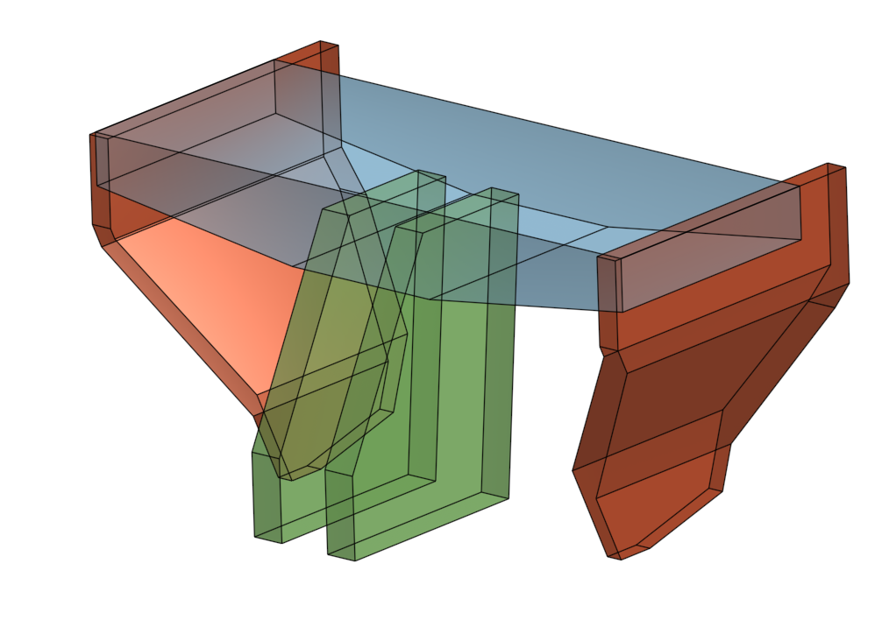

Later the regulations also define sectional characteristics for the various elements describing the rear wing, prescribing visibility, curvature limits, allowed angles and thicknesses for each component.

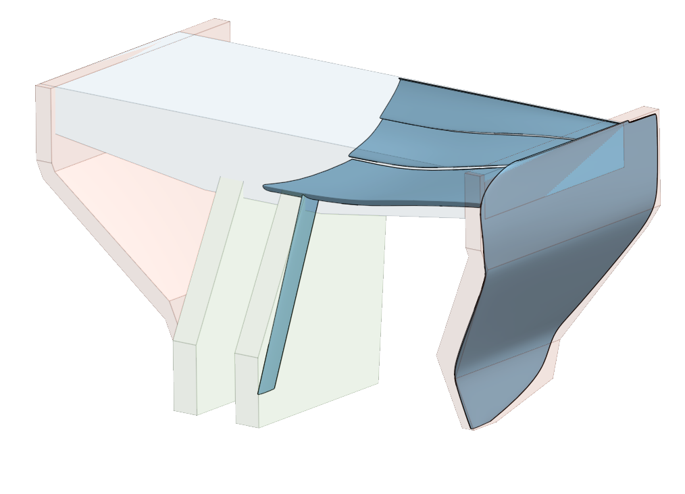

The initial geometry, consisting of an assembly of:

* endplate
* pylon
* profiles

Is shown in the following figure:

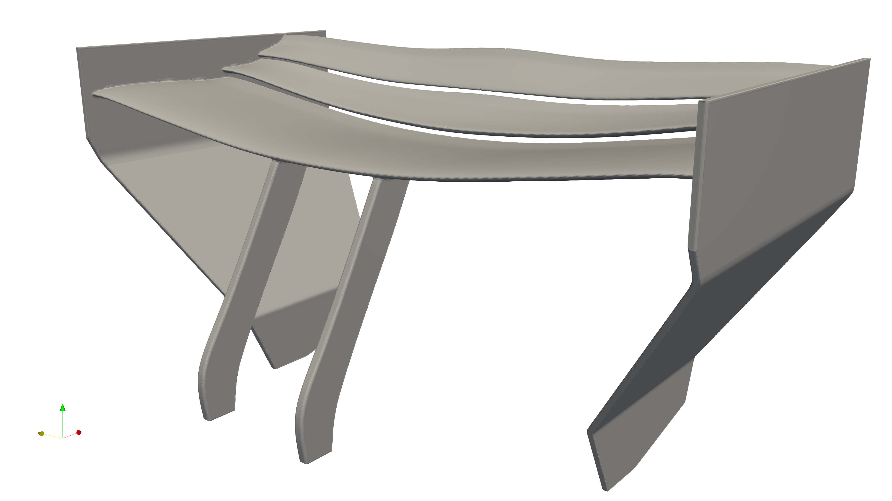

A few comments can be made regarding the initial design. Due to a lack of expertise with CAD modelling the endplates are extremely simple, generated through a series of solid extrusions, with filleted edges. This creates a very squared look, with a rounded rectangle section in the streamwise direction, completely aligned with the $x$ axis. The pylons are similarly extruded and filleted. Both structures thus show a thick trailing edge, one of many areas of possible improvement.

The profiles, on the other hand are generated as surfaces, and thus provide a more polished result. The third element trailing edge is clearly not straight, giving rise to a wavy pattern which is of dubious effectiveness. The three profiles have been developed from scratch (although starting from a set of known `.dat` files had been considered[^1]) using 2D splines. The first element has a larger chord, while the following two provide an increase in angle of attack and have a shorter chord. The wing surface spanwise shape has been controlled through the usage of 3D splines.

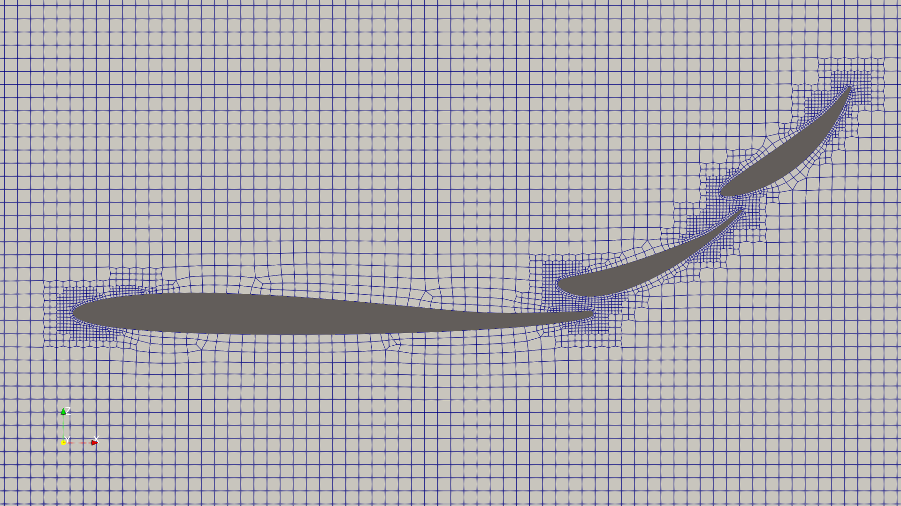

In conclusion, the initial geometry was deliberately designed with many details that left ample margins of improvement and explorations. A real F1 design cycle would certainly begin from a much more effective starting point, coming from both expertise and intuition.

### A Note on Automation

Smart CFD utilization requires the user to intervene only in areas of pre-processing, running and post-processing where critical evaluations must be made. A very hands-on approach may naively force the user to lauch each command sequentially analyzing the output at each step of the process. While not wrong many energies and resources would be wasted in repetitive tasks, which may incidentally cause lack of attention to details, leading to poor results. As a consequence script automation is a requirement for any CFD user. The simulations presented in this report were all run through bash automation, launching an `Allrun` script that sequentially invoked OpenFOAM commands or python scripts that interacted with Paraview to extract quantities of interest and images. This method has a secondary advantage: any tweak to the configuration can be instantaneously applied across many commmands and even many simulations, leading to a much less error prone pipeline.
An example of the `Allrun` script is shown in the [Appendix](#appendix-code-automation-example), to highlight the capabilities (and shortcomings) of the developed process.

### Meshing

After many failed attempts at meshing using the native OpenFOAM snappyHexMesh software, particularly with regards to the prism layer generation (often generating far less layers than the required amount in the `snappyHexMeshDict`) a different route was attempted: the cfMesh software provides similar cartesian mesh quality to snappyHexMesh, with less configuration options and a much faster turnaround time[^2]. This allowed a much quicker and more efficient development of a `meshDict` file that constructed a good quality mesh, with user specified refinement edges, surfaces, regions and more than sufficient prism layer extrusion.

Taking some suggestions from the excellent [LinkedIn post by David Penner](https://www.linkedin.com/pulse/simulating-williams-fw43bar-part-1-all-simulations-wrong-david-penner/) a base cell size on the surface of the rear wing was established at about 5 mm. Having to juggle resources with a limited hardware refinement regions had to be carefully analyzed. The solution utilized in the following report consist of the following mesh refinement strategy:

* edge refinement at the profiles leading edge and trailing edge. This was obtained through two OpenFOAM commands used in conjuction. Firstly by running `surfaceFeatureEdges -angle 2` all the angles in the rear wing geometry are computed and angles below two degrees (a threshold selected through trial and error in order to select all leading and trailing edge features) generate a splitting of the geometry into separate `.fms` files. Later the command `FMSToSurface -exportFeatureEdges` exports the *pointy* edges into a `.vtk` file that can be then used by cfMesh through the `edgeMeshRefinement` dictionary
* surface refinement on the rear wing `.stl` surface
* a first refinement box, closer to the wing, with the aim of modelling the wake of the wing
* a second refinement box, to allow a smooth transition from the coarse freestream mesh to the finer cells in the first refinement box
* generation of prism layers, with controls on the first cell height, expansion ratio and number of extruded layers

A few quick comments can be made by comparatively looking at mesh slices coming from snappyHexMesh and cfMesh:

:::: {.layout-ncol="2"}
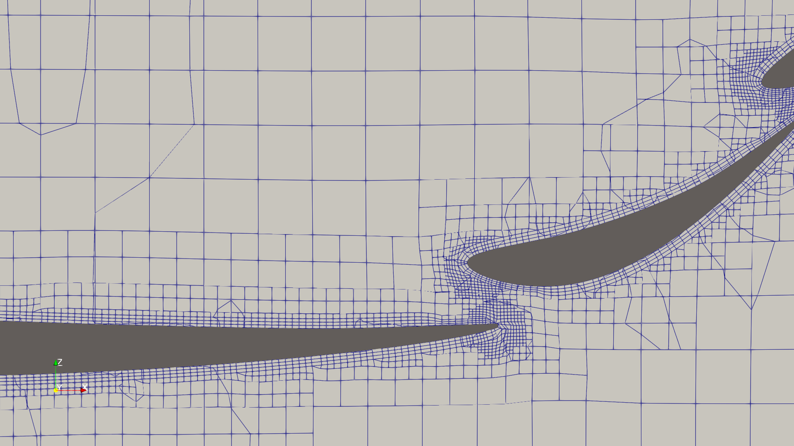

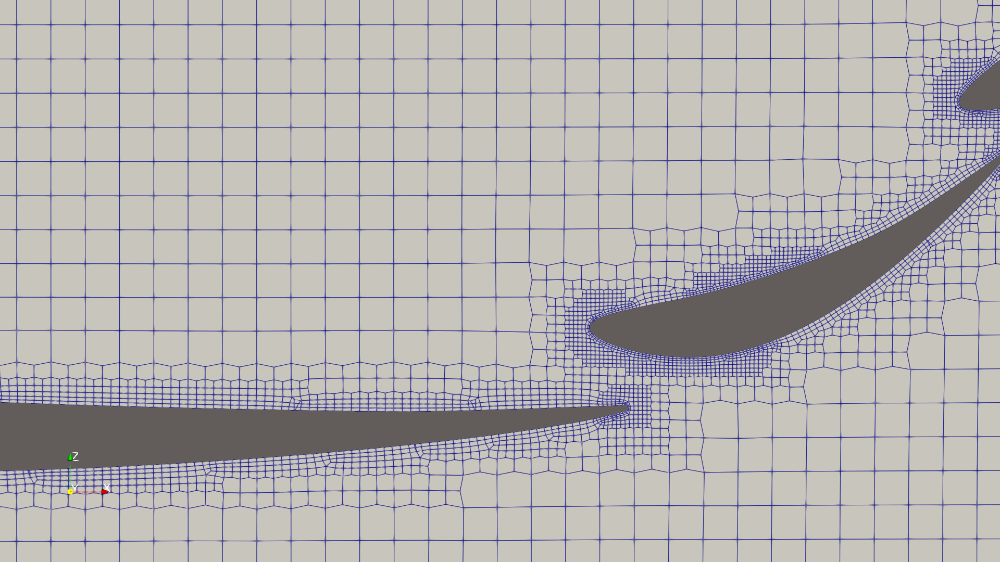
::::

While snappyHexMesh builds very consistent layers cfMesh adapts the thickness to the surrounding cells (to maintain good mesh quality), a strategy that becomes problematic in refinement regions, as the prism layer becomes much thinner (possibly getting out of the desired $y^+$ range). On the other hand the next two pictures tell a totally different side of the story:

:::: {.layout-ncol="2"}
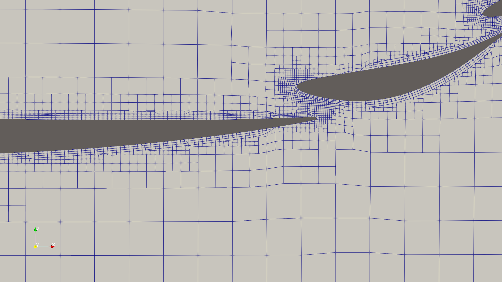

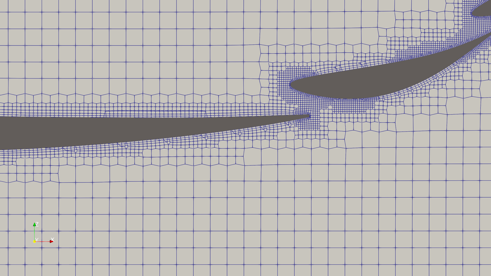
::::

In this second case the layer extrusion procedure on the pressure side and leading edge of the second element[^3] failed and no prismatic layer was created.

Another interesting observation can be made regarding the refinement algorithm for the two software options: transitioning from a single cell to two refined cells (the so-called split-quad, a pentagon obtained by refinement) snappyHexMesh tries to maintain perfectly orthogonal angles. Conversely cfMesh deforms the cell edges so that each cell is a convex pentagon. While apparently unmotivatedly complicated, the strategy applied by cfMesh is actually helpful at limiting both skewness and non-orthogonality, as the face connecting the owner and neighbour cell is angled in such a way that the vector connecting the two cell centers is a lot more similar to the face perpendicular bisector (in 2D) a.k.a. the face centered normal vector (in 3D). An excellent reading regarding mesh introduced errors can be found in the [Is it Always the Mesh?](https://cfmesh.com/is-it-always-the-mesh-part-1-discretisation-basics-and-mesh-quality-metrics/) series, found in the cfMesh blog.

Finally, a discussion regarding the boundary layer description: the *low-Re* approach is generally considered to be superior in the description of high gradients and separation regions, and it might thus seem logical to aim for a $y^+$ of approximately 1 (well within the viscous sublayer) on the rear wing surface. This is certainly the topic for an interesting comparison, with and without wall functions, but is undoubtedly out of reach for the hardware available, leading to the necessary usage of wall functions (the so called *high-Re* approach). This is done through the `nutUSpaldingWallFunction` present in OpenFOAM, which is capable of handling a more broad spectrum of $y^+$ values thanks to a continous blending function. A thorough analysis of this implementation choice might also be of interest, compared to standard wall functions that are intended to work only in the log-law region. 

Even though the choice of wall function implementation should provide some help if the first cell center is too close to the surface, a target value of $30>y^+>200$ was selected, and the automated bash script provided data extraction to verify the condition on the wing surface, as shown in the following figures[^4]:

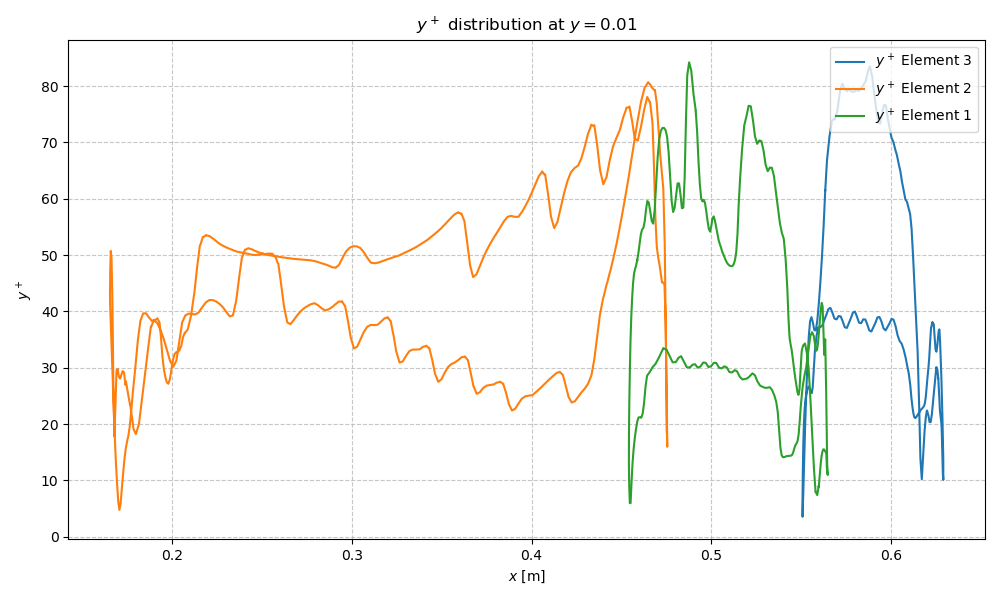

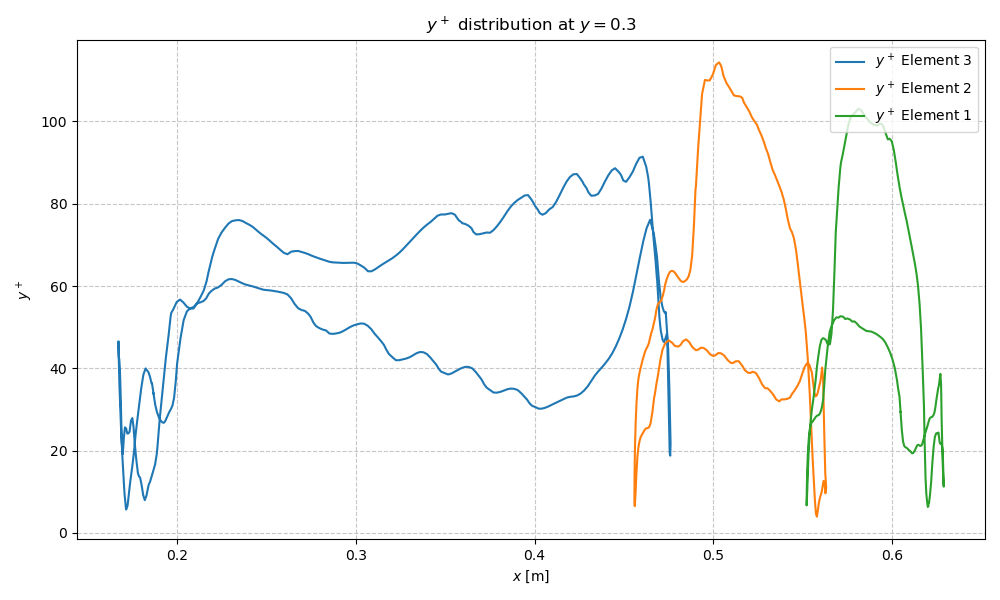

By automatically extracting these $y^+$ images at 10 different spanwise stations on the profiles, and at 5 stations on the endplates, every simulation could be checked regarding the compliance with appropriate first cell heights.

### Physics & Numerics

The simulations were performed using OpenFOAM's simpleFoam solver, a steady-state incompressible solver, alongside RANS modelling for turbulence. The complete solver configuration is detailed below.

#### Solver Settings

The following table summarizes the key numerical settings used in the simulation:

* **Application**: `simpleFoam` (steady-state incompressible)
* **Turbulence Model**: k-$\omega$ SST (Shear Stress Transport)
* **Time steps**: 500 iterations (pseudo-time iterations, being steady-state)
* **Freestream velocity**: $U_{\infty} = 50$\,m/s

The governing equations are solved using the SIMPLE algorithm(Semi-Implicit Method for Pressure Linked Equations), as the simpleFoam application name suggests, with 3 non-orthogonal correctors, due to the geometrical complexity of the wing and its prismatic layers. It was later noticed in the output of the checkMesh command that the maximum non-orthogonality was below $65^\circ$, with an average of $\approx5^\circ$. These low values serve to show the quality of the cfMesh algorithm, and suggest that the resulting mesh should likely provide good results with a single non-orthogonal corrector, possibly even none. The maximum skewness was found to be $\approx2.6$, on less than 50 cells out of the 8 millions used in the base mesh, once more proving the good quality of the mesh constructed by cfMesh.

The linear solver settings used for the simulation, found in the `fvSolution` file, are reported in the table below:

**Table 1: Linear solver settings**

::: {.table-responsive}

| Variable | Solver | Smoother | Tolerance | Rel. Tol | Sweeps |
| :--- | :--- | :--- | :--- | :--- | :--- |
| $p$ | GAMG | GaussSeidel | 1e-7 | 0.01 | - |
| $U$ | smoothSolver | GaussSeidel | 1e-8 | 0.1 | 1 |
| $k$ | smoothSolver | GaussSeidel | 1e-8 | 0.1 | 1 |
| $\omega$ | smoothSolver | GaussSeidel | 1e-8 | 0.1 | 1 |

:::

The discretization schemes used to move from the Navier-Stokes to equations to a set of algebraic equations, found in the `fvSchemes` file, is described in the following table:

**Table 2: Discretization schemes**

::: {.table-responsive}

| Operator | Scheme |
| :--- | :--- |
| Time derivative | Steady-state |
| Gradient | Gauss linear (cell-limited for $U$) |
| Divergence | linearUpwindV for momentum, upwind for turbulence |
| Laplacian | Gauss linear (corrected) |
| Interpolation | Linear |
| Normal gradient | Corrected |

:::

As it can be noticed, the schemes used aim for second order convergence (`linear`), a standard requirement in modern industrial CFD, only dropping to first order (`upwind`), for the discretization of the divergence terms in the turbulence two equation model; cell-limited and bounded second order schemes are used to avoid unphysical oscillations.

#### Boundary Conditions

The computational domain consisting of 7 boundary patches applies the following BC:

* **inlet**: Velocity inlet with fixed velocity, $\vec{U} = (50, 0, 0)$\,m/s
* **outlet**: Pressure outlet with fixed gauge pressure, $p = 0$\,Pa
* **rearWing**: No-slip condition, $\vec{U}_{wall} = 0$
* **lowerWall**: Fixed velocity moving ground, $\vec{U} = (50, 0, 0)$\,m/s
* **symmetry**: Symmetry plane at $y = 0$
* **outside**: Far-field slip boundary
* **upperWall**: Far-field slip boundary

Boundary conditions applied in the turbulence model equations are detailed in the following list, only highlighting the choices that were actively considered with respect to a default tutorial.

* **Inlet**: Fixed values: $k = 0.01$\,m$^2$/s$^2$, $\omega = 700$\,rad/s; coming from Spalart & Rumsey [@spalart2007], as suggested by [Penner](https://www.linkedin.com/pulse/simulating-williams-fw43bar-part-1-all-simulations-wrong-david-penner/), and calculated $\nu_t$
* **Walls (rearWing, lowerWall)**: Wall functions using `nutUSpaldingWallFunction` for $\nu_t$, `kqRWallFunction` for $k$ and `omegaWallFunction` for $\omega$
* **Outlet**: Inlet-outlet conditions for $k$ and $\omega$, with calculated $\nu_t$

In order to get a better convergence of steady steady iterations the initial conditions were given by:

* Velocity: uniform $U = (50, 0, 0)$\,m/s
* Gauge pressure: uniform $p = 0$\,Pa

The linear model solver potentialFoam was used from this starting condition to obtain a velocity field that could comply with the compatibility conditions (i.e. guaranteeing coherence between BC and IC). Once potentialFoam convergence was reached the resulting field was used as an initial condition for the RANS model solved with simpleFoam, adding the initial conditions:

* Turbulent kinetic energy: $k = 0.01$\,m$^2$/s$^2$
* Specific dissipation rate: $\omega = 700$\,rad/s

The flow was initialized with uniform freestream conditions and solved for a number of iterations sufficient to reach convergence. To estimate convergence first, as suggested by the brilliant page [cfd.university](https://cfd.university/blog//how-to-determine-the-best-stopping-criterion-for-cfd-simulations) the evolution of equation residuals was used to evaluate whether the first simulation was approaching convergence, divergence or an oscillatory plateau. Inspection of the following image shows a tendency towards convergence with small size oscillations that will predictably continue as long as the simulation is carried out.

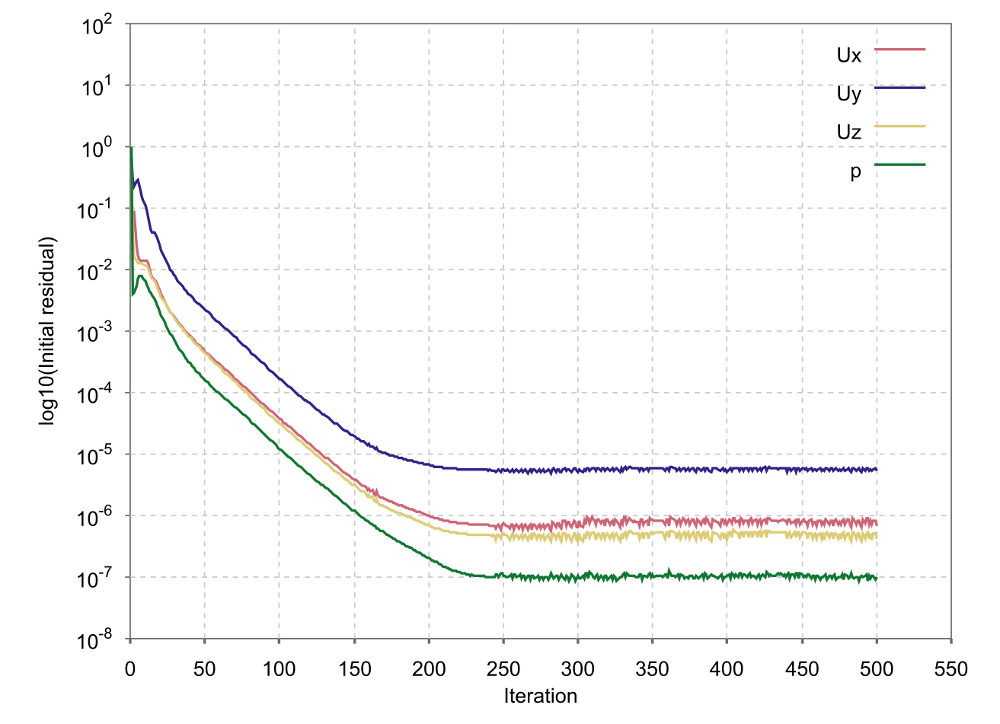

Given the satisfactory converged appearance of the residuals, the next step suggested is to look at many different integral quantities, to evaluate the approach to a converged state of different flow quantities (as mentioned in the webpage lift coefficient is mainly driven by pressure, while the drag coefficient is more influenced by velocity gradients, thus using both to understand convergence gives a better look at the evolution of different aspects of the flow solution). In this case it as decided that lift, drag and moment coefficients should be analyzed, and thus a python script extracting the time evolution of these three integral quantities was developed and added to the bash script automation, so that convergence of each simulation could be quickly evaluated at a glance. The results for the basis simulation are shown in the next set of images:

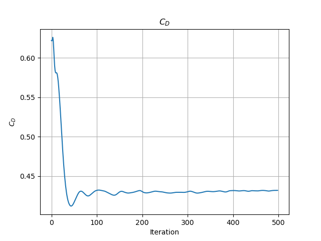

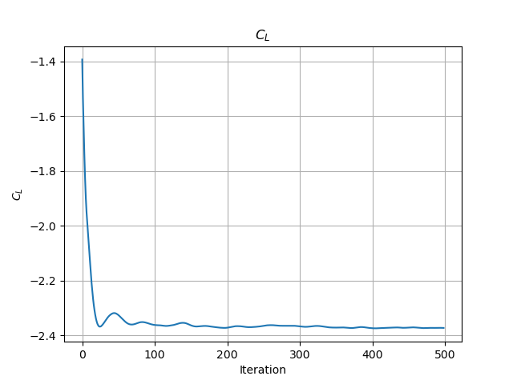

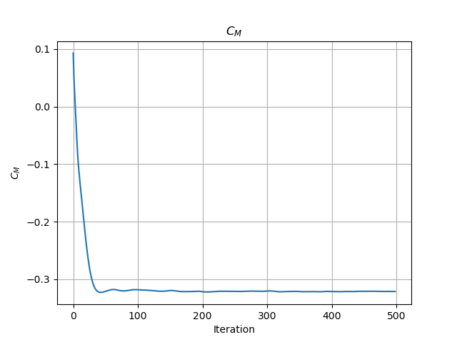

As expected convergence of the three coefficients does not seem to happen exactly at the same pseudo-time iteration, nonetheless at the end of the 500 iterations a clear steady state converged value is approached by all three. Once these steps are completed the same [webpage](https://cfd.university/blog//how-to-determine-the-best-stopping-criterion-for-cfd-simulations) suggests that an Asymptotic Convergence Threshold (ACT) should be established through a script that dynamically evaluates the state of the simulation. This would certainly help at minimizing the number of iterations utilized (thus wasting minimal computing resources), however the criterion of 500 iterations was considered sufficient for this simple case[^5], and the implementation of the ACT framework was left as a work for a later project.

Finally, as a result of this first study on convergence a window size of 200 iterations was chosen to compute average values the converged steady state integral coefficients to be evaluated when comparing different rear wing geometries.

### Grid Convergence Study
Once a solid simulation framework was established a mesh convergence study was performed using cfMesh to guarantee grid-independent solutions. Three mesh densities were evaluated on the initial geometry: a coarse one, a medium one and a fine one. The following table summarizes the mesh configurations and key settings:

**Table 3: Mesh configuration summary for convergence study**

::: {.table-responsive}

| Parameter | Coarse | Medium | Fine |
| :--- | :--- | :--- | :--- |
| Number of cells | 1,490,057 | 4,953,036 | 7,709,701 |
| Cell size (1st refinement box) | 0.08 | 0.0156 | 0.01 |
| Cell size (2nd refinement box) | 0.15 | 0.0625 | 0.05 |
| Cell size (wing surface) | 0.035 | 0.005 | 0.0035 |
| Cell size (sharp edge refinement) | 0.0017 | 0.0015 | 0.0013 |
| Prismatic layers number | 1 | 2 | 2 |
| 1st prismatic layer max. thickness | 0.008 | 0.008 | 0.008 |

:::

As can be seen the first cell maximum height was kept fixed, and the value was computed by estimating a $y^+\approx100$ using a flat plate analogy. All other parameters are instead refined moving from a mesh to finer one.

The next table presents the aerodynamic coefficients extracted through windowing and averaging for each mesh level:

**Table 4: Aerodynamic coefficients for mesh convergence study**

::: {.table-responsive}

| Mesh Level | **$C_{D,mean}$** | **$C_{L,mean}$** |
| :--- | :--- | :--- |
| Coarse | 0.4585 | -2.4051 |
| Medium | 0.4450 | -2.4286 |
| Fine | 0.4305 | -2.3700 |

:::

The grid convergence analysis was performed using the Grid Convergence Index, in the derivation presented by Celik *et al.* [@celik2008], which will be now briefly summarized.

First a mesh representative grid spacing is computed for the three grids as:
$$h_j = \left(\frac{1}{N_{cells}}\sum_{i=1}^{N_{cells}}\Delta V_i\right)^{1/3}$$

For $j\in[1,2,3]$, representing the three refinement levels ordered as 1=fine, 2=medium and 3=coarse.

Then the refinement ratio between successive grids is defined as:
$$r_{ij} = \frac{h_i}{h_j}$$

And for meaningful convergence results one should aim for $r_{ij}\geq1.3$, in order to evaluate meshes that vary in a significant enough manner.

By calling $\phi_i$ the evaluated quantity for the $i$-th grid (in this case the two integral coefficients $C_D$ and $C_L$) a useful indicator can at this point be defined as the *convergence ratio*:
$$CR = \frac{\phi_2 - \phi_1}{\phi_3 - \phi_2}$$

Notice that:

* $CR<1$ indicates oscillatory divergence
* $-1\leq CR\leq0$ indicates oscillatory convergence
* $0\leq CR\leq1$ indicates monotonic convergence
* $CR\geq1$ indicates monotonic divergence

At this point a loop procedure is entered:

1. a value for the order of convergence $p$ is guessed, usually 1 or 2
2. define $s = \text{sign}(\frac{\phi_3 - \phi_2}{\phi_2 - \phi_1})$
3. update $p = \frac{1}{\log{r_{21}}}|\log(|\frac{\phi_3 - \phi_2}{\phi_2 - \phi_1}|)+\log(\frac{r_{21}^p - s}{r_{32}^p-s})|$
4. exit the loop when $p$ converges

With the order of convergence we can compute the Richardson extrapolated value as:
$$\phi_{expected} = \phi_1 + \frac{\phi_1 - \phi_2}{r_{21}^p - 1}$$

Also, we define:
$$\varepsilon_{ij}=\left|\frac{\phi_j - \phi_i}{\phi_j}\right|$$

So that we can compute the GCI as:
$$GCI_{ij} = \frac{1.25\cdot\varepsilon_{ij}}{r_{ij}^p-1}$$

Which can be expressed as a percentage when multiplied by 100. The target value should be to have $GCI\leq5\%$ when doing parametric studies, and $GCI\leq1\%$ when extracted values are of paramount importance.

We finally define the *asymptotic range* as:
$$AR = \frac{GCI_{32}}{r_{21}^p-1}$$

Which offers a good measure of much further should the mesh be refined, and gets closer and closer to 1 as the grid becomes refined *enough*.

Using the GCI toolbox, the refinement ratios found are:

* $r_{21} = 1.16$
* $r_{32} = 1.49$

Which emphasizes that the variation between the medium and the fine cell is not large enough. This nonetheless contrasted with the hardware limitations, and was accepted for the subsequent analysis.

The convergence ratio computed for the drag coefficient in this case is $CR=1.07$, indicating monotonic divergence, while the same indicator for the lift coefficient comes out to be $CR=-2.49$, indicating oscillatory divergence.

This is, at a very practical level, a terrible result: the finest mesh is not fine enough to establish a mathematically converging behaviour with respect to the medium and coarse one, and thus for both drag and lift the order of convergence numerically computed is a $p=\text{NaN}$ value, not allowing a GCI estimate.

Having met the hardware limit for the finest mesh possible it was not possible to go further with the refinement, and thus it was decided to accept a risk: the fine mesh would be used at this stage for the aerodynamic development of the wing, and the described limitation will be addressed and fully resolved in a later section by offloading the final geometry to an AWS cloud computing instance for a proper grid convergence verification, to establish a proper GCI[^6].

This limitation will be addressed and fully resolved in a later section by offloading the final geometry to an AWS cloud computing instance for a proper grid convergence verification.

### Post-Processing

As previously mentioned the post-processing workflow is fully automated through the `Allrun` script, which orchestrates all visualization and data extraction tasks using ParaView and custom Python scripts. The complete workflow consists of the following stages:

#### Force Coefficients Computation

Force coefficients were computed using the OpenFOAM `forceCoeffs` function object configured inside `system/forceCoeffs`:

* **Reference area**: $A_{ref} = 0.2$\,m$^2$
* **Direction vectors**: Lift = $(0,0,1)$, Drag = $(1,0,0)$, Pitch axis = $(0,1,0)$
* **Freestream velocity**: $U_{\infty} = 50$\,m/s

The function object outputs:

* $C_L$: Lift coefficient (negative for downforce)
* $C_D$: Drag coefficient
* $C_M$: Pitching moment coefficient

Each coefficient is given as the sum of pressure and viscous contributions:

* $C_{L,p}$, $C_{D,p}$, $C_{M,p}$: Pressure forces
* $C_{L,visc}$, $C_{D,visc}$, $C_{M,visc}$: Viscous forces

Notice that aerobalance data, i.e. loads as they are divided between the front and rear wheels, are extremely useful and common in modern racing aerodynamics, as they offer a chance to investigate stability and drivability. Nonetheless having a simulation only looking at the rear wing this balance data does not really make any sense, and will thus not be detailed in this report.

The results are written at each time step to `postProcessing/forceCoeffs/`, enabling convergence monitoring directly from the terminal during runtime[^7].

While force coefficients are computed at runtime, both to verify convergence and to allow windowing and averaging for more accurate results, other flow quantities of interest are extracted later by running `simpleFoam -postProcess`, which looks for a `system/postProcessDict` file. This is done in order to reduce the computational overhead at runtime, as post-processing tools were found to increase the memory requirement, sometimes leading to OOM fatal errors. The `postProcessDict` is used to extract:

* wall shear stress field on the wing surface, $\tau_w$
* wall bounded streamlines, to mimic flow-vis paint visualizations
* turbulence normalized wall distance, $y^+$
* the $\lambda_2$ vortex criterion

ParaView was then used through the `results3DPostProcessing.py` script to generate 3D visualizations including pressure coefficient fields, wall shear stress magnitude[^8], $\lambda_2$ criterion, and velocity field representations. Wall-bounded streamlines were extracted to visualize flow attachment and separation patterns. This same script is used to compute field variables as $C_p$ and $C_p^{tot}$[^9], and it also extracts $C_p$ and $y^+$ data along spanwise slices. Examples of the extracted images are shown in the following pictures:

:::: {.layout-ncol="2"}
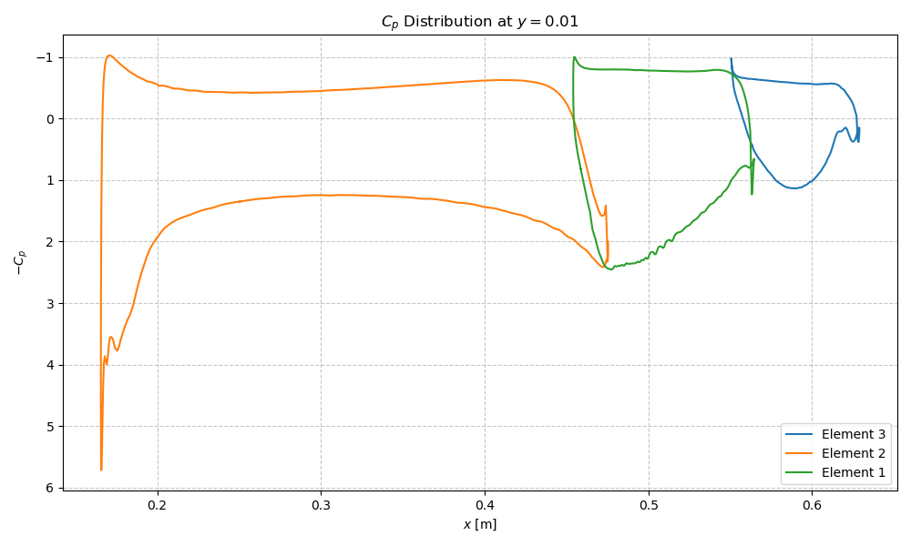

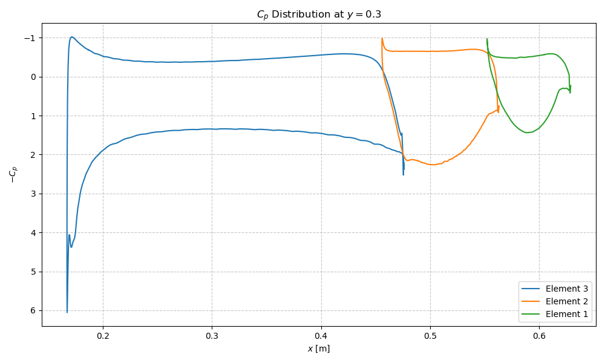
::::

:::: {.layout-ncol="2"}
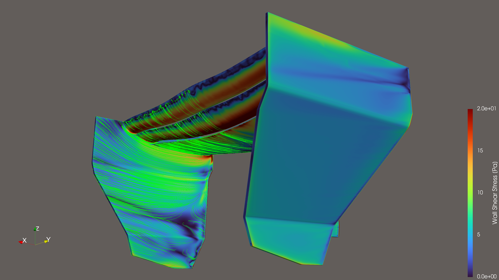

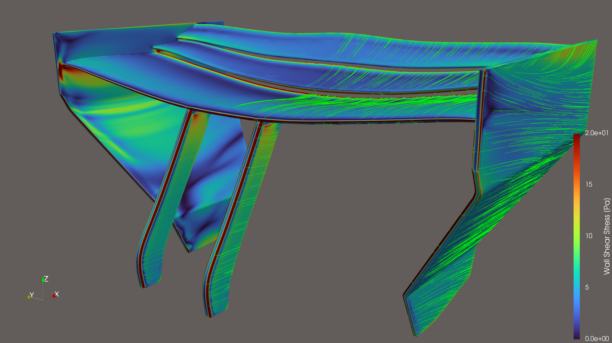
::::

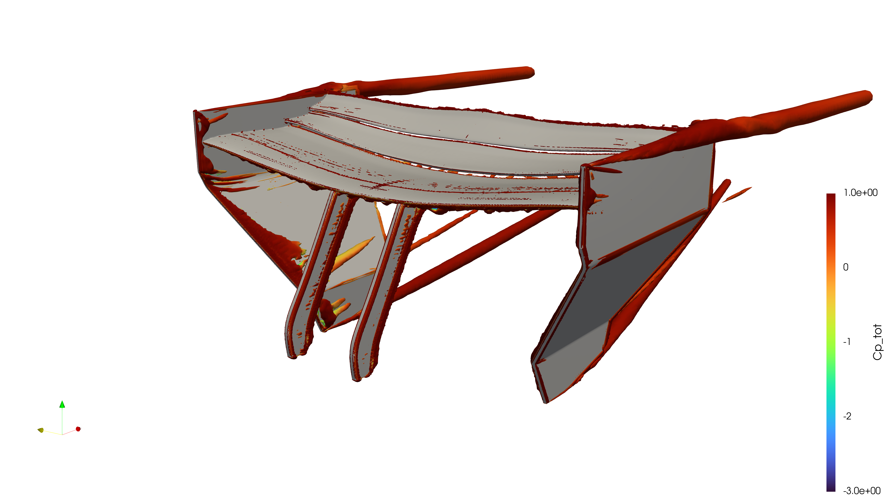

While 3D images are useful for getting a broad picture of the overall flow development, and a good conceptual understanding of the most important flow features, they do not allow precise tracking of structures, and are thus less suited to geometry design and optimization. With this in mind a `results3DPostProcessing.py` script was developed, which generates high resolution images of a series of slices taken by moving cutting planes in the $x$, $y$ and $z$ directions. Such pictures were generated to show $C_p$ and $C_p^{tot}$ distributions on the wing surface and in the wake, including the same representation with Line Integral Convolution (LIC) superimposed[^10]. A few examples of the resulting 2D visualizations are shown in the following:


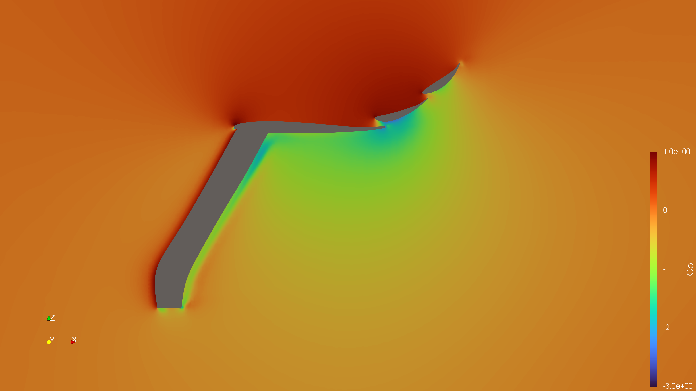

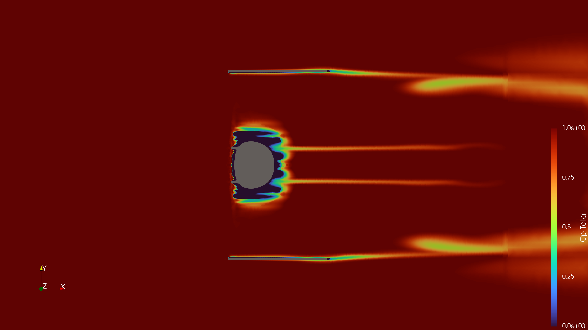

All 2D renderings are also combined into mp4 video animations, showing the evolution of structures in the three directions:



Finally a custom Python script (`caseSummary.py`) performs automated data extraction from the pseudo-time history of the simulation and computes mean values over the last 250 iterations to ensure stable averages. This script also updates the master `casesSummary.csv` file, available for overall numerical results comparison, with all extracted data.

A final PDF report highlighting some details regarding convergence history, simulation setup and results is automatically generated using Marp from a Markdown template.

---

## Results and Discussion

The development of an evolution to the starting geometry required going through 14 different iteration. Not all of these will be discussed in detail, as many subsequent geometry changes were aimed at solving similar aerodynamic issues.

First of all the starting geometry results, coming from the fine (7.7 million cells) mesh, are to be discussed, in order to introduce the main area of improvement[^11].

### Initial results

The initial geometry with non optimized 2D profiles, bluff endplates and bluff pylons returned a drag coefficient of $C_D=0.431$ and a lift coefficient of $C_L=-2.370$, both averaged over the final 250 iterations.

Looking at the wall shear stress distribution superimposed with limiting streamlines it is possible to highlight a few key observations:


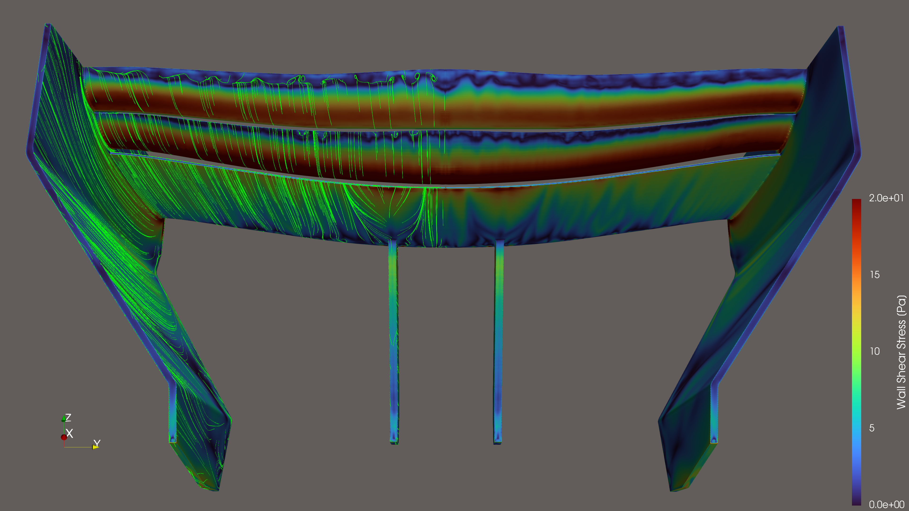

The flow appears to remain attached for the entirety of the first profile. The second and third element exhibit some weak flow in the trailing edge area, with the limiting streamlines of the third element showing detached flow and recirculation. The flow near at the profiles-endplate junction is attached and *healthy*, but a very large region of separation is visible in the lower portion, where at least a saddle point and a node point are clearly identifiable according to the topological interpretation of separated flows by Tobak and Peake [@tobak1982]. The bottom views highlights the presence of some flow structure downstream of the blunt pylons, which can be better seen through the $\lambda_2$ criterion visualization:

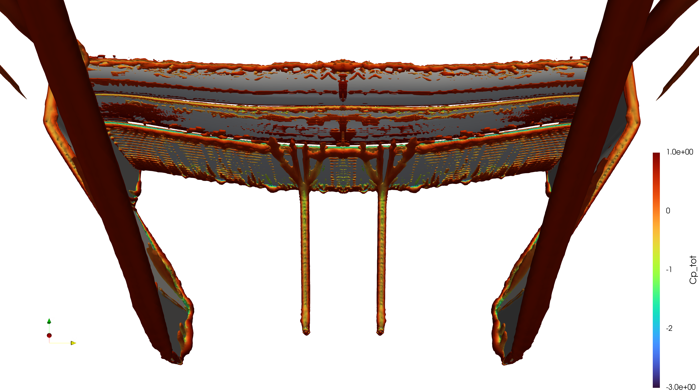

A couple of V-shaped vortical separated structures extend downstream from each pylon, thus reducing efficiency with no apparent benefit.
The $\lambda_2$ criterion also makes it possible to see three strong vortices forming at each endplate:

* at the top, the strongest one is caused by the pressure side flow spilling over, similarly to the classic tip vortex of any wing (albeit with a much more efficient result)
* at the bottom the opposite effect is visible, where the low pressure between the endplates and the profiles draws in air from the outside
* a vortex is released close to the bottom, where the endplate aggresively changes both the *dihedral* angle and the chord

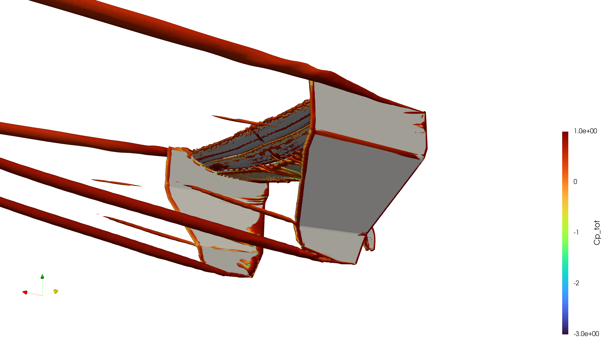

The bottom view of the wall shear stress surface contour plot also shows an interesting aspect: while the leading edge of the second and third element are coloured red, showing high energy flow, the leading edge of the first element hints at weak flow development, with possible separation. The first element was initially designed with the leading edge aligned with the $x$-axis, and this is the possible cause of this low energy region. To further investigate this flow behaviour $y$-normal 2D slices were analyzed:




From the image the situation appears very clear: the low pressure of the suction side (and similarly the high pressure of the pressure side) bend the flow downward, causing an effective negative of attack of the first element leading edge. This in turn causes leading edge separation, which leads to a thick dissipative wake and a consequent increase in drag.

### Design Evolution
The rear wing design was thus evolved with a few corrections needed in mind:

* The pylon should use a streamlined cross section, specifically a symmetric profile
* The wavy trailing edge, especially on the third element, increases the vorticity released in the wake, and thus drag
* the first element leading edge should be aligned with the local partially downwards flow

At the same time a few corrections were added as they were expected to introduce performance gains:

* The first element should have a longer chord, to maximize the angle of attack, and thus the suction, of the second and third element while remaining inside the regulatory bounding box [^12]
* The third element was made slimmer and more cambered
* A Gurney flap was added for maximum downforce extraction by adding extreme camber at the trailing edge

The evolved geometry can be seen in the next image:

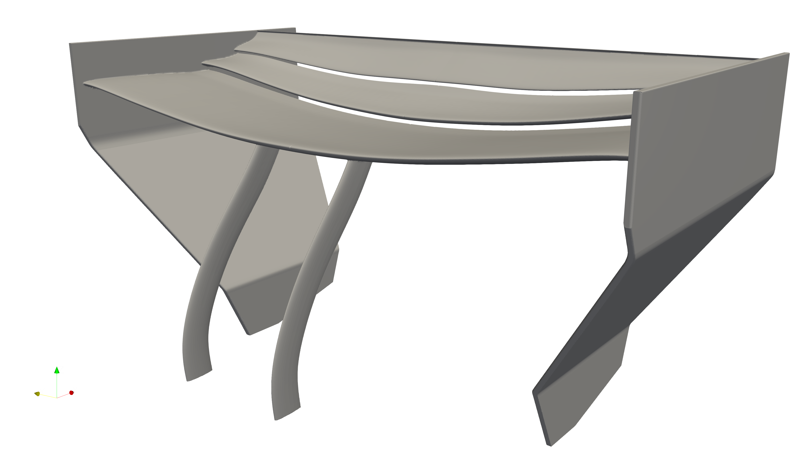

This design iteration provided a drag coefficient of $C_D=0.510$, an 18.3% increase , and a lift coefficient of $C_L=-2.722$, a 14.9% increase. Clearly the research of performance, i.e. downforce, was going in the right direction, but efficiency could be increased.

The revised pylon immediately proved effective, as the V-shaped vortical structure was heavily reduced and almost removed:

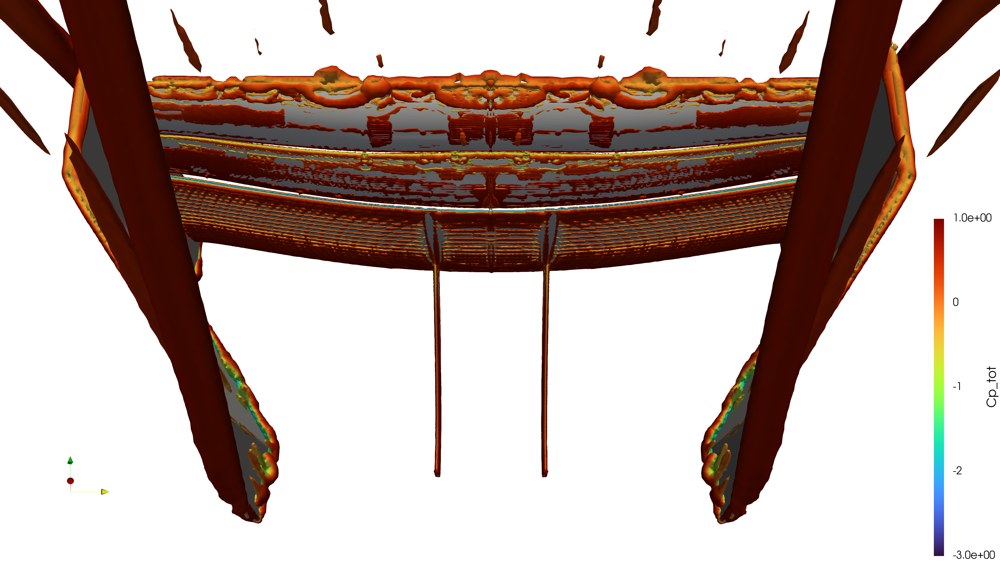

The increase in downforce brings of course an unavoidable increase in the intensity of the endplate vortices, so part of the drag added is found there. Nonetheless the newfound suction also causes a more extreme endplate leading edge separation due to lateral cross flow, as can be seen in the next pair of images:




The leading edge variation proved to be effective, as the first element separation was almost completely suppressed:




Nonetheless by looking at the pressure distribution on the three sections it was possible to notice a pronounced pressure peak, with $min(C_p)<5$, which causes a strong adverse pressure gradient, which in turn increases the boundary layer thickness:

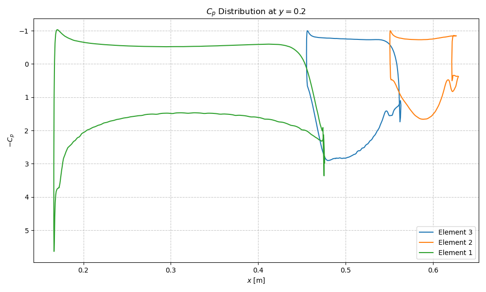

For this reason the first element leading edge could be further optimized by making it more downwashing. This correction was added to the next important design iteration, which introduced a newly designed endplated, generated though a lofted surface, with the goal of making it smooth and reduce separation. All trailing edges were now thin and streamlined, thus pressure drag was expected to be much lower. The geometry is shown in the next figure:

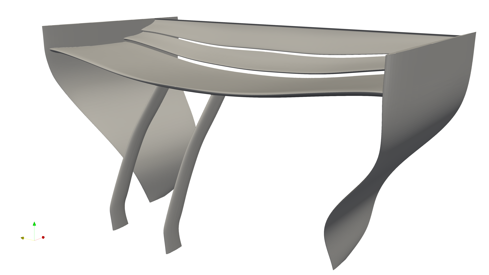

This design seemed to correctly address the issues of the previous geometry: the drag was reduced by 3.3%, to $C_D=0.493$, while the lift coefficient increased by 2% to $C_L=-2.777$. Some post-processing allowed to focus on the most promising development paths and problematic areas.

Firstly, as can be observed in the next image the smoothed endplate removed the vortex generated at the change in chord and dihedral previously highlighted, a good example of drag reduction:

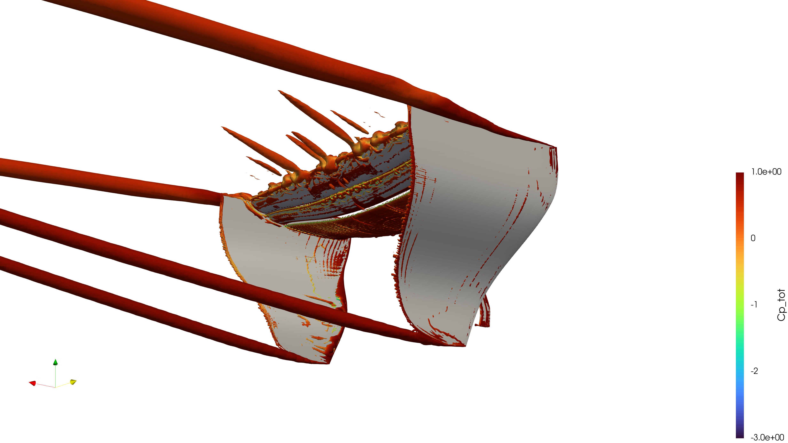

Some endplate leading edge separation remained present even after this evolution, although much weaker than that in the previous design, an issue to be addressed again with better alignment of the cross sections of the lofted geometry:

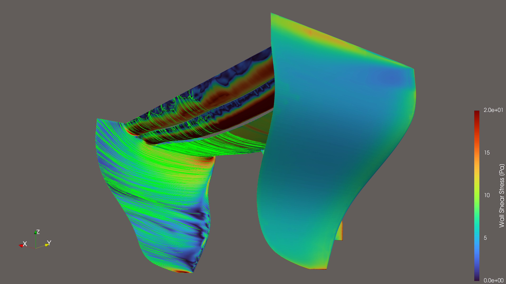

The following development focused on downforce generation, with the target of maximizing suction. Looking back at the regulation box for the profiles, i.e. the RV-RW-PROFILES reference volume, it was noticed that the vertical became smaller and smaller in the spanwise direction moving towards the tip. This forces the profiles to have a dihedral angle, but it also means that the angle of attack of the second and third element tend to reduce moving outwards. To counter this effect the chord of the tips of the second and third flaps was made smaller, while making it longer for the first element so that a larger angle of attack could fit within the reference volume.
A second upgrade was the introduction of a rounded top side leading edge for the endplate, in order to reduce drag. Finally, a pretty aggressive cutout downstream of the third element was added in order to investigate its effectiveness, compared to the pre-2022 rear wing regulation. Ideally such a cutout should help mitigate the tip vortex intensity, thus increasing efficiency.
This new geometry can be seen in the images below:

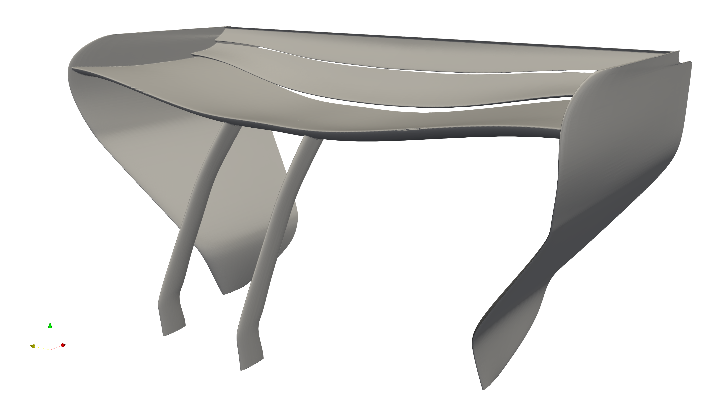

:::: {.layout-ncol="2"}
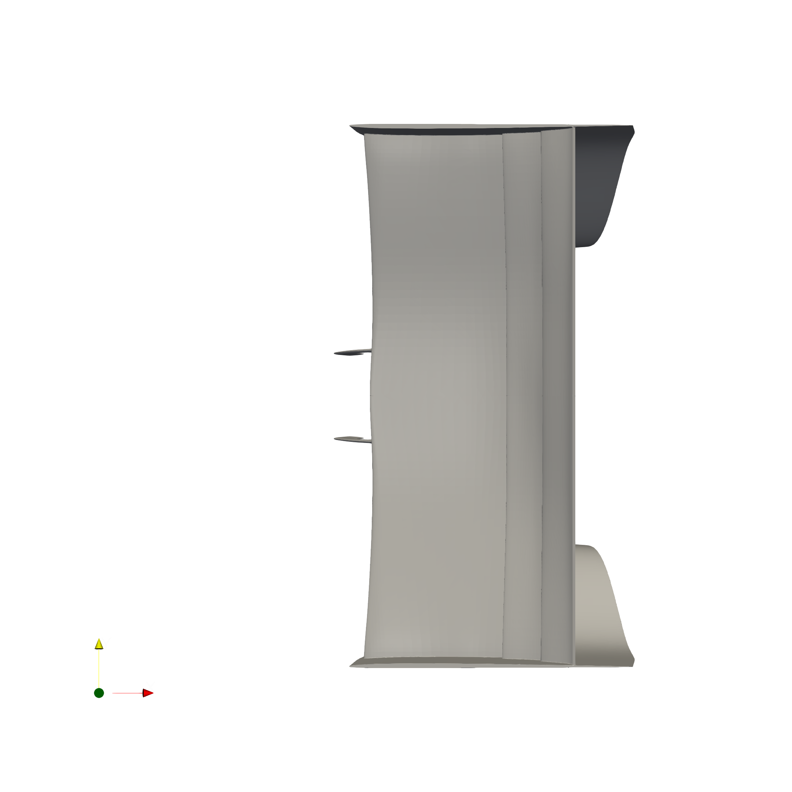

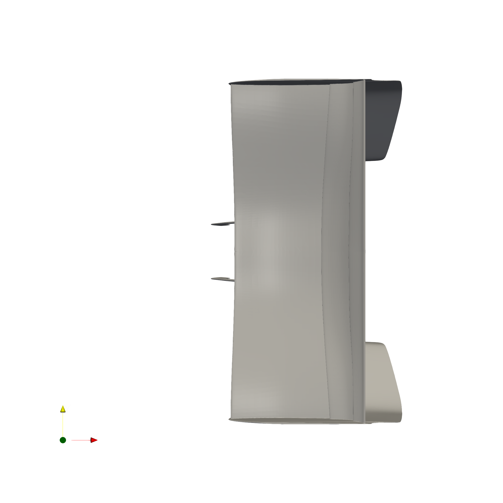
::::

The following image details the change in the last two profiles. By visual inspection it is also clear that the slot gap between the first and second element is not optimized, and the second element leading edge design probably leaves some room for better flow alignment.

:::: {.layout-ncol="2"}
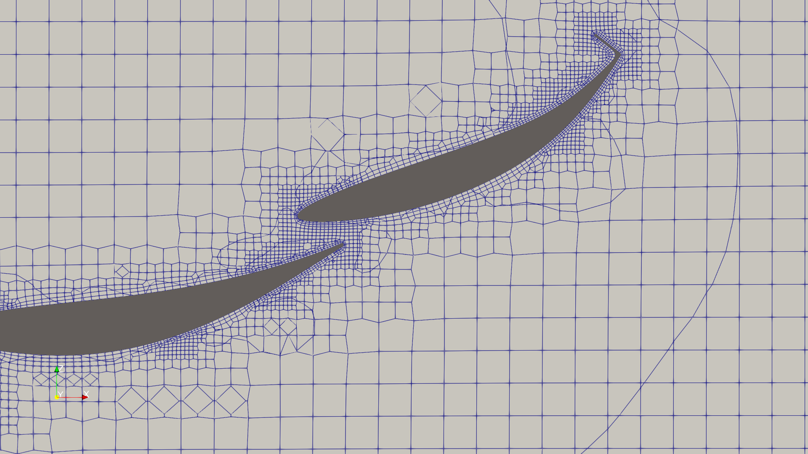

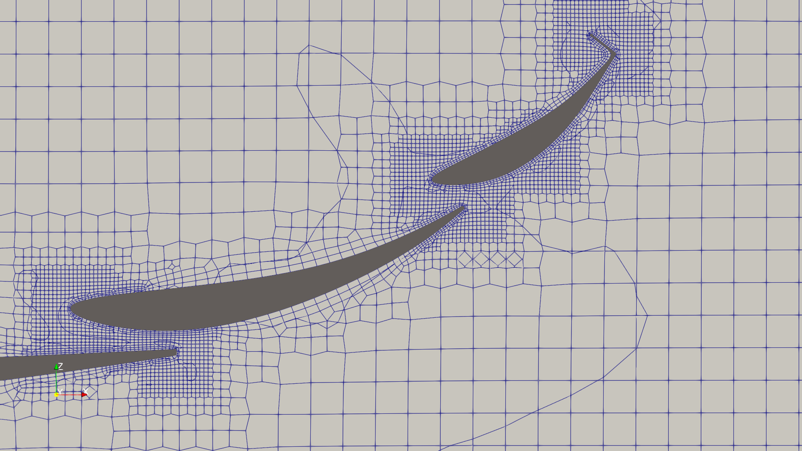
::::

This renovated rear wing produced a significant jump forward in downforce, with the lift coefficient magnitude increasing by 4.9% to $C_L=-2.912$; at the same time drag saw an uptick by 3.9%, getting to $C_D=0.512$.

A nice finding was that endplate separation was almost completely eliminated by changing the cross section, as can be seen in the $z$-normal video, or in the following images:




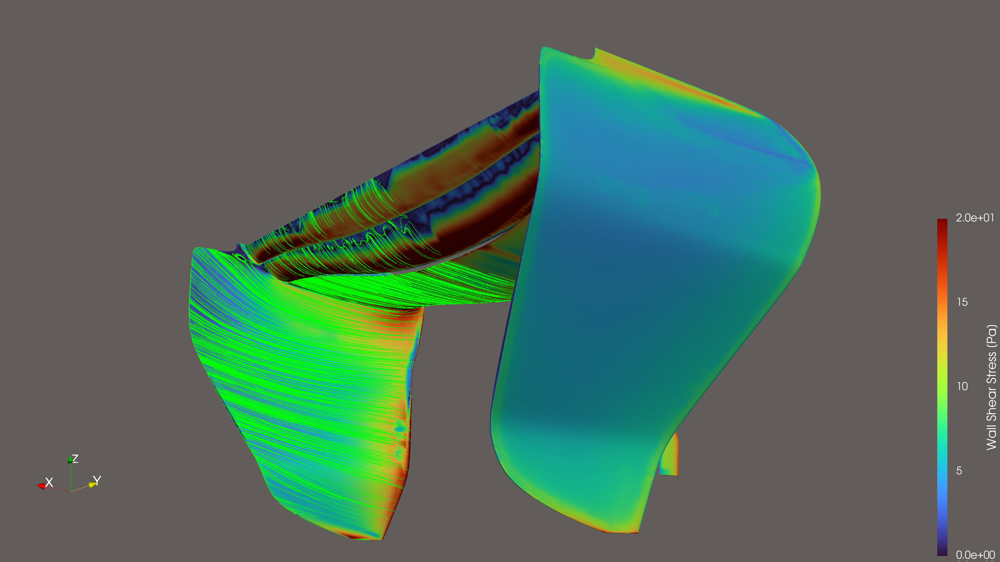

The above image shows that some trailing edge separation is present on the second and third profile. While acceptable on the third element, flow detaching from the second one is better avoided, a goal for next design iterations.

The suboptimal first slot gap design can be quantified by inspecting the following $C_p-x$ plot, where it is evident that the first element is generating lift at the trailing edge. Notice nonetheless a reduction in the suction peak at all leading edges:

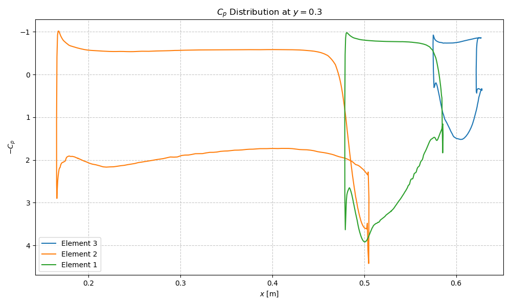

Finally inspection of the $x$-normal animation showed some junction separation, suggesting that the wing tips designed could still be improved.




The next geometry focused on maintaining a high downforce, with some efficiency gain: it focused on slot gap effectiveness to reduce separation, and better leading edge alignement. The leading edge and trailing edge spanwise evolution was evolved using a more accurate lofting strategy[^13]. The endplate cutout was also reduced, as can be seen below:

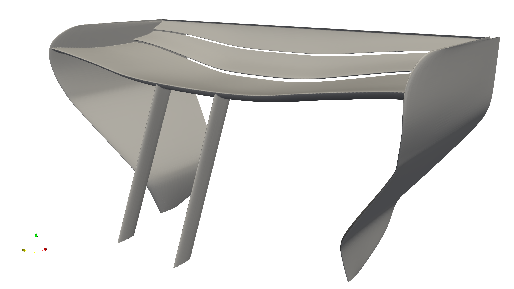

The effects of this evolution were immediatley apparent: downforce slightly changed to $C_L=-2.914$ (a negligible increase of 0.01%), while drag was reduced to $C_D=0.491$, down 4.1%, a significant amount.

Separation on the second and third element was greatly reduced in intensity, and the endplate maintained attached flow throughout:

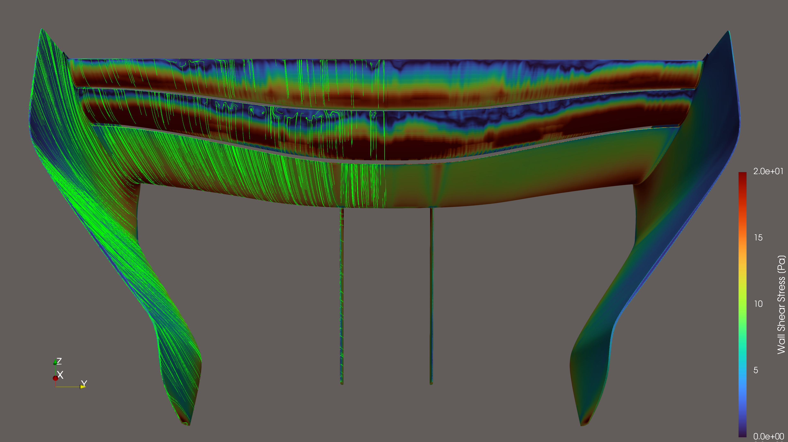

Slot gap effectiveness was increased as expected, with the pressure profile showing a much healthier state:

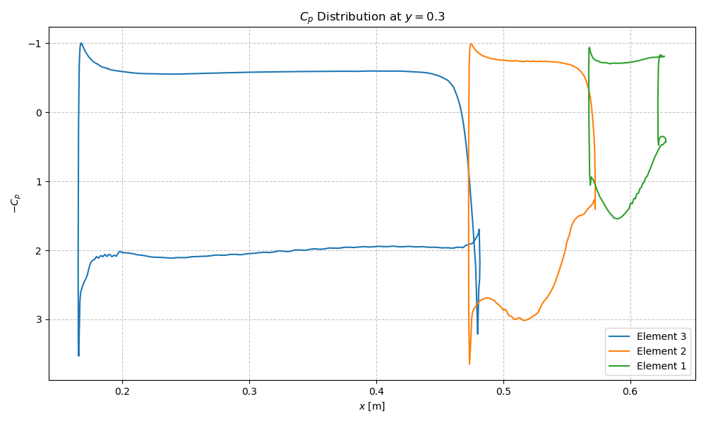

Looking at the $x$-normal slices the large amount of junction losses and third element separation is evidently removed, causing a slimmer wake, evidence of effective drag reduction:




The wing seemed to have no hugely problematic area, so it was decided that one final iteration would be developed before moving on. The aim of this final design was maximum downforce generation, thus an increase in the angle of attack of the second and third element was introduced, both at the root and at the tip.

:::: {.layout-ncol="2"}
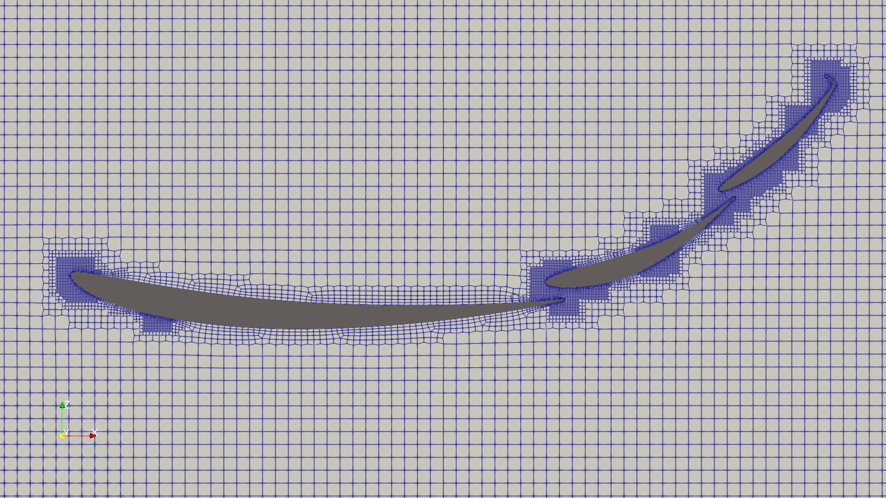

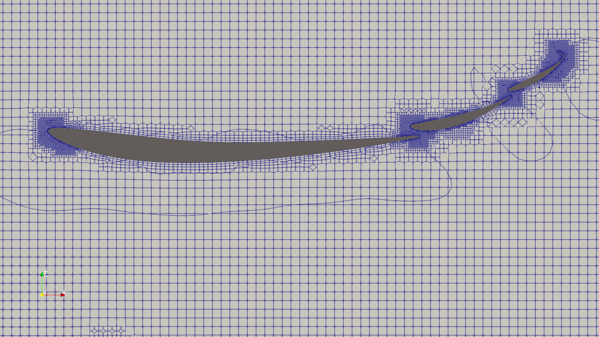
::::

The coefficients responded as expected, downforce spiking to the maximum value found in the entire design space of $C_L=-2.950$, a 1.2% increase. Drag, as expected, saw an increment of 1.6%, getting to $C_D=0.499$, which was considered adequate for the present research. While it is possible to go even more aggressive with the angle of of attack at the trailing edge managing separation would certainly get trickier, so more aggressive designs were left as a future topic.

It was interesting to notice that during the more recent developments, while reducing the separation at the endplate leading edge, the vortex midway through the endplate was back:

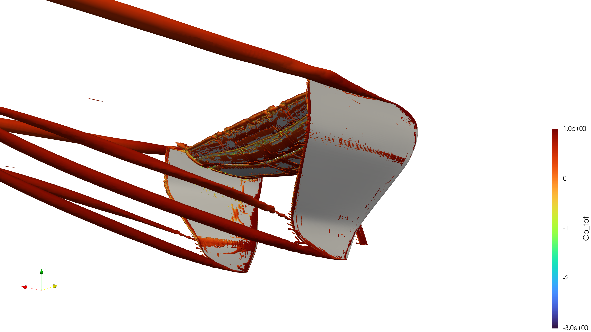

This is actually a desirable effect[^14] as it is caused by the expansion generated by the endplate. This expansion works together with the profiles to increase downforce, as visible in the next images:

:::: {.layout-ncol="2"}
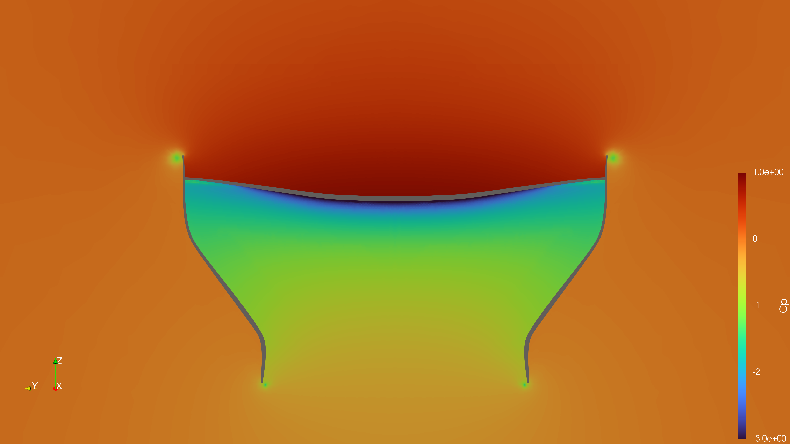

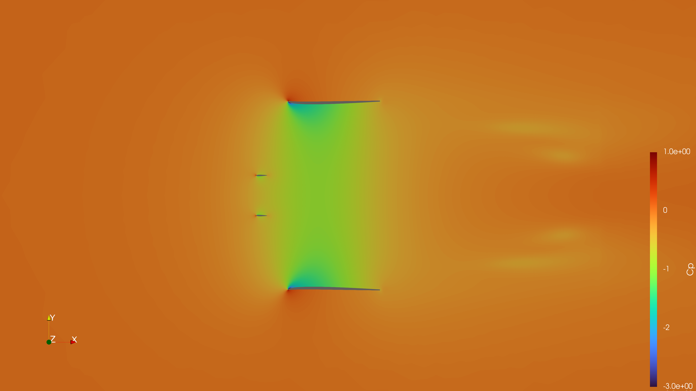
::::

A nice feature of this final design is the usage of slimmer profiles, which thus are able to produce considerable downforce with a lower drag generated[^15]. Junction separation was kept at a minimum, and the profiles seem to provide mostly attached flow down to the trailing edge:




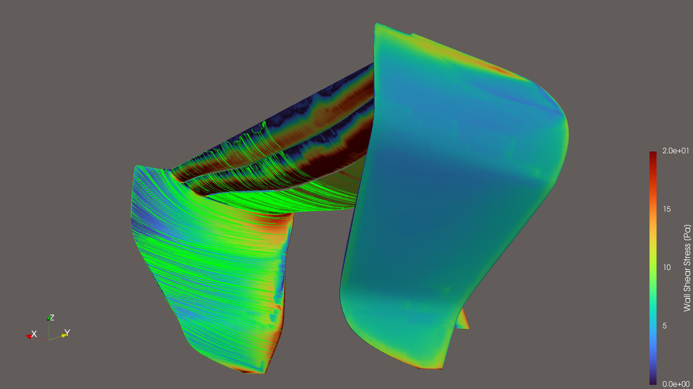

:::: {.layout-ncol="2"}


::::

The results of the design process are finally summarized in the following table, where $\Delta$ values are computed with respect to the initial geometry:

**Table 5: Aerodynamic coefficients for the analyzed rear wing configurations, with percentage deltas relative to the initial design**

::: {.table-responsive}

| Description | $C_D$ | $C_L$ | $L/D$ |
| :--- | :--- | :--- | :--- |
| Initial geometry | 0.431 | -2.370 | -5.50 |
| Streamlined pylon, revised LE | 0.510 (+18.3%) | -2.722 (+14.8%) | -5.33 (-3.1%) |
| Lofted endplate, thin TEs | 0.493 (+14.4%) | -2.777 (+17.2%) | -5.63 (+2.4%) |
| Revised profiles, endplate cutout | 0.512 (+18.8%) | -2.912 (+22.9%) | -5.69 (+3.5%) |
| Slot gap and LE refinement | 0.491 (+13.9%) | -2.914 (+22.9%) | -5.93 (+7.8%) |
| Increased AoA, final design | 0.499 (+15.8%) | -2.950 (+24.5%) | -5.91 (+7.5%) |

:::

The only comparison found online for the same 2026 regulation is the [LinkedIn article](https://www.linkedin.com/pulse/simulating-f1-2026-rear-wing-article-2-power-aerodynamics-ted-l-w4skc/) by Ted L., where he reports a maximum downforce of 1414.5 N. Using the reference values to transform the lift coefficient into a force the optimal design turns out to produce about 1806.9 N, approximately 27.7% more downforce, indicating that at least some key design choices were taken in the correct direction.

### Straight Line Mode (SLM) Configurations

Once an appropriate high-downforce configuration was found four additional cases were simulated to evaluate the Straight Line Mode (SLM): a feature of the 2026 regulations that allows the rear wing to reduce flap incidence for lower drag during high-speed straights. These four designs were developed to evaluate different pivot point strategies, also looking at the choices made by F1 teams for the 2026 season.

#### A brief comment & caveat

The simulation of the wing presented in the previous sections did not involve the SLM fairing, which is the aerodynamic fairing that shields the mechanisms and actuators needed for straight line mode activation. This of course causes the results to be numerically off if compared to the actual numbers found on real 2026 F1 cars. Nonetheless the simulations were aimed at profiles and dihedral optimization, and thus the simulations were carried out without detailing the fairing. This discussion will become important in the following section, as the choice of fairing is heavily dependent on the SLM strategy chosen. As a result numbers regarding straight line mode should be read critically.

#### Alpine style SLM

This first strategy, implemented by the Alpine F1 Team consists of the flap, made of the second and third element, rotating downwards of $\approx30^\circ$ about a point at the leading edge of the second element:

:::: {.layout-ncol="2"}
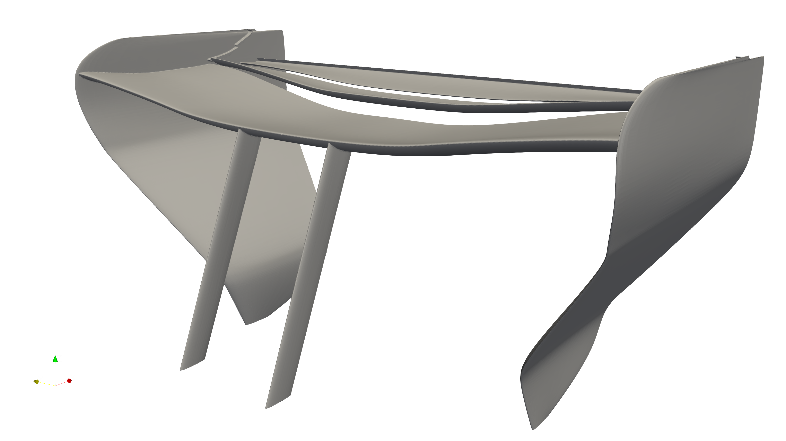

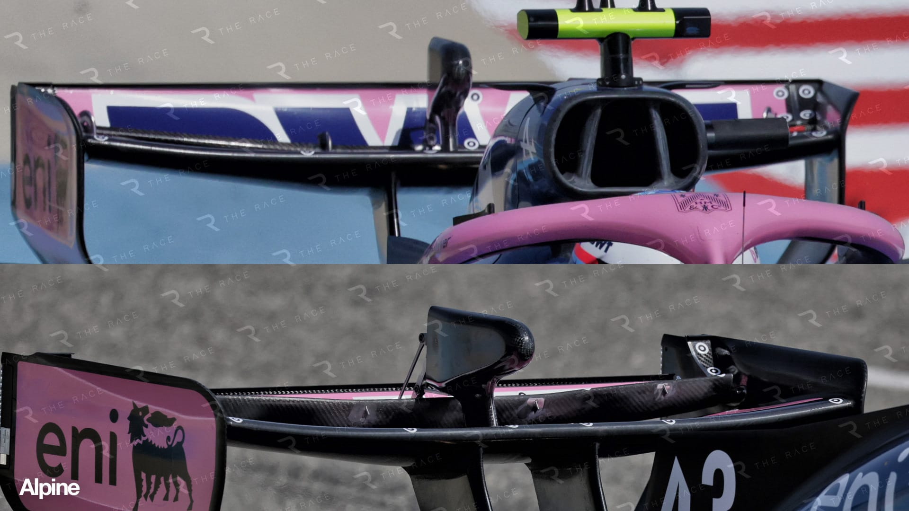
::::

Due to the presence of the slot gap this strategy is limited, in the rotation angle, by the fact that the rotated second element should not intersect the mainplane, which would result in a disruptive failure:

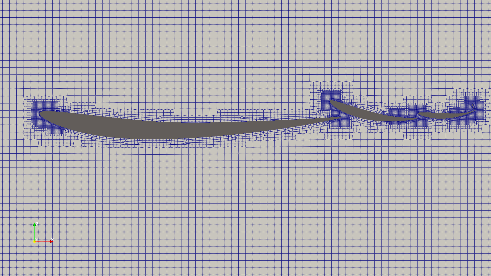

The effect of SLM is immediately apparent when looking at $y$-normal slices. The second element leading edge generates a strong separation on the pressure side, but having such high camber profiles at low incidence reduces greatly the amount of upwash generated by the wing, thus reducing downforce and most importantly drag.



This first strategy for the pivot point of SLM results in $C_D=0.109$, a 78.2% drag reduction and $C_L=-0.709$, a 76.0% reduction.


#### Regular style SLM

The second strategy is called *Regular* as it appears on most 2026 cars, and it rotates the second and third element of $\approx32^\circ$ about the third element trailing edge, bringing the second element leading edge gap. This SLM implementation generates a very large gap between the mainplane and the opened flap, as can be seen below:

:::: {.layout-ncol="2"}
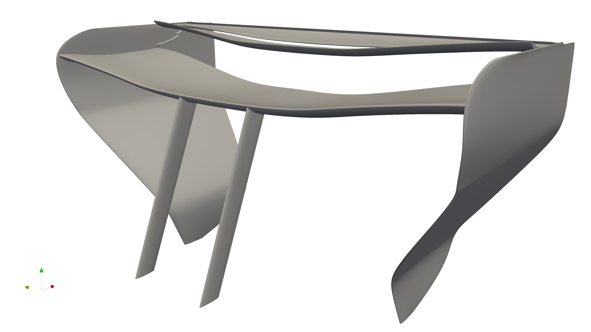


::::

This version of the rear wing generated a drag coefficient of $C_D=0.118$, down 76.3% w.r.t. corner mode, and a lift coefficient of $C_L=-0.884$, a 70.7% reduction. The numbers seem to suggest that this strategy is less effective then the Alpine style SLM, but inspection of $y$-normal slices reveals that the simulated implementation is producing a significant amount of upwash:




The heavily cambered flap is pushing the flow upwards, and the second element leading edge separation is not as pronounced as in the previous SLM strategy. All these results suggest that the flaps are producing too much downforce, and thus induced drag, due to the incidence, which is too high. Further lowering the flaps angle of attack should as a consequence prove beneficial.

#### Macarena style SLM

The third strategy is the most eye-catching innovative aerodynamic concept appeared on the 2026 F1 grid so far. Ferrari presented this in the last day of Bahrain testing, and it involves the second and third element rotating around a point located at about the midpoint of the third element. Instead of rotating of $\approx30^\circ$ the flaps continue their rotation for a total of $\approx210^\circ$, taking advantage of the 2026 regulations specifying an actuation time for the flap rotation of 0.4 s, enough to rotate by more then the standard amounts. In this way the nominal trailing edge of the wing, i.e. the Gurney flap, becomes a leading edge. This strategy generates an even larger gap between the mainplane and the flaps. Another feature of this design in the absence of the conventional SLM fairing. The actuators are in this case located inside the endplates, and the central fairing pillar is not needed. This novel strategy can be seen in the below images:

:::: {.layout-ncol="2"}
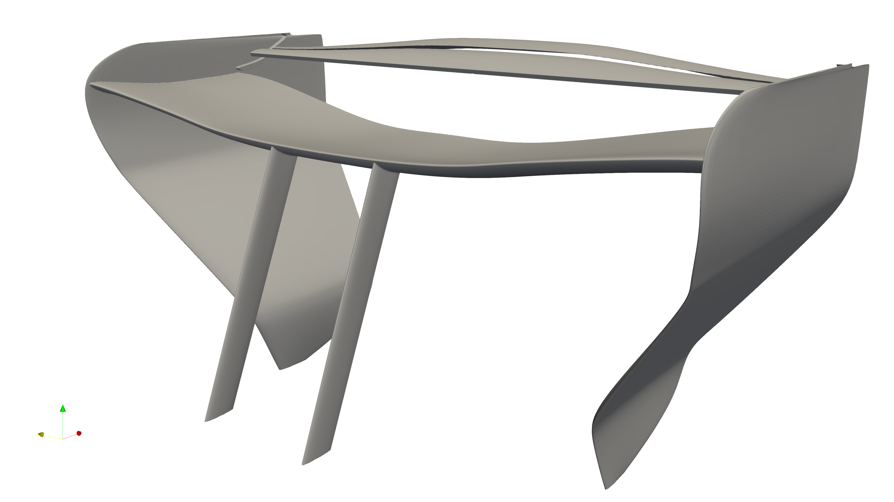

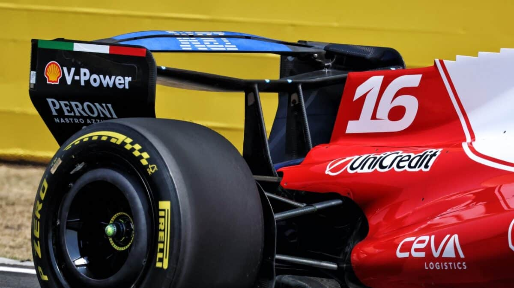
::::

This wing is characterized by a drag coefficient of $C_D=0.089$, an 82.1% decrease, and a lift coefficient of $C_L=-0.067$, down 97.7% with respect to corner mode. The results evidently support the effectiveness of this design, as almost all downforce is eliminated and drag is cut down massively. The reason for this behaviour can be seen through the $y$-normal animation, where the almost complete absence of upwash is noteworthy. The rotated flaps induces downwash on the flow out of the mainplane, thus bringing drag reduction to a minimum. Having no downwash from the mainplane should also help reducing the diffuser expansion more effectively than other strategies, thus cutting down on downforce and drag in another key component. The leading edge separation bubble at the Gurney also seems much smaller due to the relative size of third and second element. As a final observation, perhaps the rotation is a bit too large, and reducing it by a couple of degrees can make the upwash even less significant.




A few notes must made regarding specifically the Macarena style CFD simulation:

* The utilized CAD geometry did not have a proper bulge in the endplate to simulate the SLM actuators
* Ferrari had introduced another interesting device in the same Bahrain testing: an exhaust pipe winglet. This geometry is generating upwash of exhaust gases, and certainly interacting with the downwash caused by the upside down flaps. For this reason the complex interaction of this SLM strategy cannot be predicted with certainty, and performance benefits can be easily under or over estimated

Nonetheless this CFD analysis seems to indicate that the avenue of an upside-down flap for SLM is promising and is worthy of consideration, also explaining Ferrari interest in testing it multiple times to get the mechanism to properly work for races usage.

#### Optimized regular style SLM

The fourth and final strategy is a revised regular style SLM. Since Macarena SLM produced very promising results it was deemed interesting to compare it to the most common SLM implementation, when the latter is optimized for better drag reduction. More specifically the optimization involved a rotation of $\approx37^\circ$, more than the previous version.
This makes the whole wing more similar to the SLM brought by McLaren on this year's car, as can be seen:

:::: {.layout-ncol="2"}
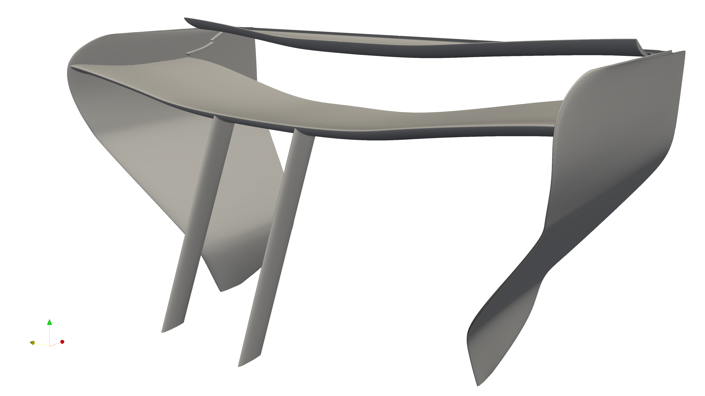


::::

As can be seen by moving in the spanwise direction the separation bubble is much larger, and as a consequence upwash is almost nonexistent. The downside is slightly thicker wake when compared to the Macarena strategy. This is reflected in the results, with a drag coefficient of $C_D=0.092$, still higher than Macarena, and a lift coefficient of $C_L=-0.348$, confirming that the mainplane is still working similarly to the nominal corner mode.




A final comment comparing Macarena and optimized regular style SLM can be made by analyzing the following pictures:

:::: {.layout-ncol="2"}
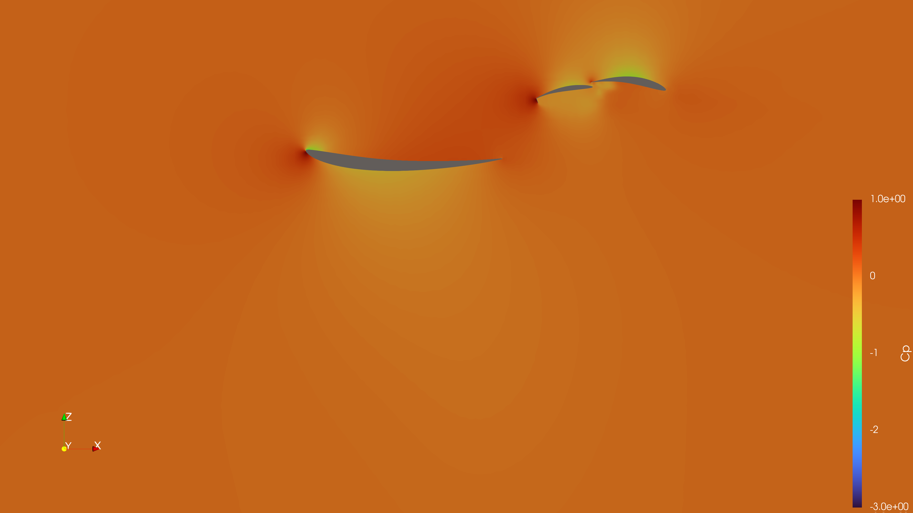

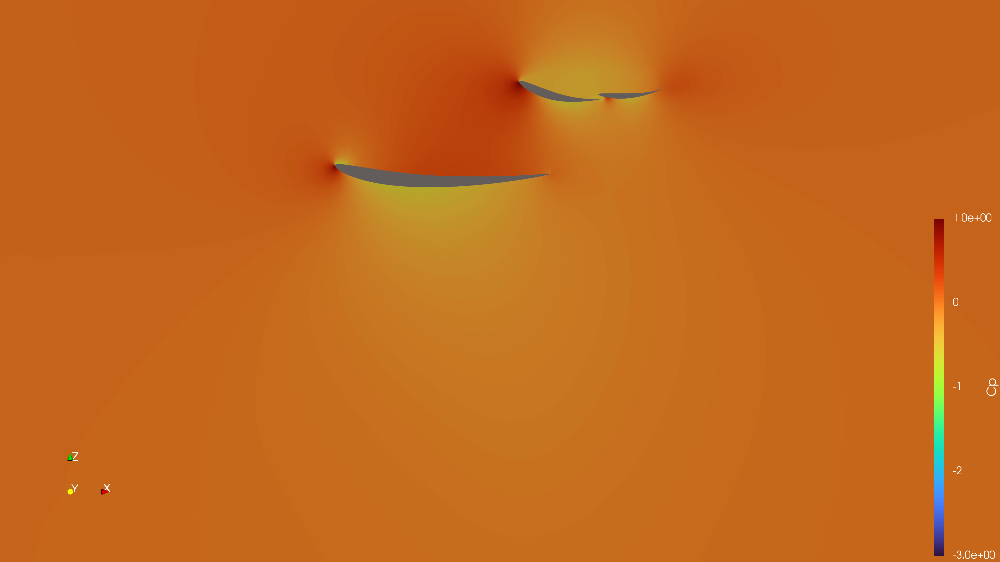
::::

The regular style wing, having the flap positioned much closer to the first element in the horizontal direction (due to the kinematics of the rotation), generates more high pressure on the pressure side of the wing. Also the suction side of the mainplane seems to work more effectively, thus increasing downforce and drag. The rearward shift in the flap position using Macarena SLM can thus be interpreted as a further advantage of this setup.

#### SLM Results & Conclusions

The following table summarizes the aerodynamic coefficients for the SLM configurations. Notice that all rows regarding $C_L$ are red, as a downforce reduction is in theory a downside. Nonetheless in SLM the most important quantity is drag and drag reduction, as the 2026 generation of cars is characterized by lower energy delivered by the power unit on a per lap basis[^16] As a consequence, an efficient straight-line mode is critical: failing to reduce drag adequately at high speed will result in a straight-line speed deficit, exposing the car to overtakes on the main straights.

**Table 6: Aerodynamic coefficients for different SLM configurations, percentage deltas are relative to the final rear wing design in corner mode**

::: {.table-responsive}

| Case | $C_{D}^{mean}$ | $C_{L}^{mean}$ | $L/D$ |
| :--- | :--- | :--- | :--- |
| Alpine style | 0.1086 (-78.2%) | -0.7087 (-76.0%) | -6.53 (+10.4%) |
| Regular style | 0.1184 (-76.3%) | -0.8841 (-70.0%) | -7.47 (+26.3%) |
| Macarena style | 0.0892 (-82.1%) | -0.0665 (-97.7%) | -0.75 (-87.4%) |
| Optimized regular style | 0.0918 (-81.6%) | -0.3482 (-88.2%) | -3.79 (-35.8%) |

:::

While many details can still be investigated and simulated with higher accuracy the results of this research support some trends found looking at the 2026 F1 cars:

* the regular style SLM, more similar to the old DRS mechanism is perhaps the easiest to conceive and to design in order to obtain large amounts of drag reduction
* Alpine style SLM seems to necessitate a very collaborative mainplane design, considering the disadvantage of having the rotation angle limited
* the Macarana style SLM probably offers the most potential to be exploited, though careful interaction with other elements of the car is required and is complex from a mechanical point of view

### A Final Discussion on Grid Convergence
As the previous discussion made clear, obtaining proper grid convergence on a personal laptop was impossible, and simulation time was extremely long even for this simplified simulation running for a small amount of pseudo-time iterations, taking more than 10 hours per case. Considering also the time required to adjust the geometry and smooth out possible issues arising in the meshing procedure the time required ballooned pretty quickly. While not initially considered when developing and simulating the geometry, during later stages of the work the investigated solution was AWS, a cloud computing platform offered by Amazon, which offers tight CLI integration and many choices of compute instances to run extremely large simulations rapidly. By going though cloud computing it was possible to simulate the same geometry on a much finer mesh, with the goal of verifying grid convergence.

#### AWS Setup
The advantage of using AWS is that the options for compute instances allowed the simulation pipeline to be kept almost identical to the one used on the local PC. After creating an AWS account and installing AWS CLI it was possible to establish an SSH connection to an EC2 compute node chosen accurately for its performance and compatibility. AWS also offers S3 as a storage option, which allowed rapid upload and download of simulation data to and from the personal computer. After an SSH connection was active it was only a matter of installing all required software (i.e. `OpenFOAM`, `Paraview` and its dependencies, `ffmpeg` and `marp`) and running the bash scripts.

The selection of the `m7i.48xlarge` instance was dictated by the high memory bandwidth and computational density required for large-scale CFD solvers like OpenFOAM. Featuring 192 vCPUs and 768 GiB of RAM, this instance leverages the 4th Generation Intel Xeon Scalable (Sapphire Rapids) architecture, which introduces DDR5 memory. The transition to DDR5 is critical for fluid dynamics simulations, as these workloads are frequently memory-bound; the increased bandwidth ensures that the large number of cores remains productive without being throttled by data retrieval latency.

#### Running on AWS
AWS was actually used to simulate the last 8 design iterations of corner mode, and all 4 options for SLM. Keeping the same mesh setup, in order to have results comparable to the ones obtained with the personal laptop, every simulation (pre-processing, running and post-processing) required less then 30 minutes. The huge instance is certainly not optimized for a mesh with less then 10 million cells, but the timed saved using cloud computing was still immense, more than 95%.

#### Grid Convergence Index Analysis
Once a suitable AWS setup was found, it was possible to increase the mesh refinement and simulate to do a more proper grid convergence verification. It was decided that the final corner mode geometry would be used for this analysis, in order to verify the results for a design that was deemed sufficiently refined. The mesh specifications can be found in the table below:

**Table 7: Mesh configuration summary for convergence study (AWS)**

::: {.table-responsive}

| Parameter | Coarse | Medium | Fine |
| :--- | :--- | :--- | :--- |
| Number of cells | 1,541,066 | 10,280,664 | 33,678,514 |
| Cell size (1st refinement box) | 0.08 | 0.01 | 0.006 |
| Cell size (2nd refinement box) | 0.15 | 0.05 | 0.015 |
| Cell size (wing surface) | 0.035 | 0.0035 | 0.003 |
| Cell size (sharp edge refinement) | 0.0017 | 0.0013 | 0.0011 |
| Prismatic layers number | 1 | 2 | 4 |
| 1st prismatic layer max. thickness | 0.008 | 0.008 | 0.008 |

:::

The fine mesh is considerably larger, which is promising for a proper GCI study. The results found with these new meshes are:

**Table 8: Aerodynamic coefficients for mesh convergence study (AWS)**

::: {.table-responsive}

| Mesh Level | **$C_{D,mean}$** | **$C_{L,mean}$** |
| :--- | :--- | :--- |
| Coarse | 0.5440 | -2.9876 |
| Medium | 0.4992 | -2.9500 |
| Fine | 0.4941 | -2.9382 |

:::

With these new finer meshes both $C_L$ and $C_D$ exhibit monotonic convergence, with convergence ratios of $CR=0.313$ and $CR=0.153$ respectively, confirming good mesh separation between coarse, medium and fine. The estimated order of convergence is $p=1.41$ for $C_L$ and $p=2.50$ for $C_D$, the latter being close to the theoretical second-order accuracy of the numerical scheme used. The asymptotic range indicators are $AR=0.946$ for $C_L$ and $AR=1.048$ for $C_D$, both close to unity, suggesting that the solution is extremely close to the asymptotic regime. The GCI values for the finest mesh pair are below $1.1\%$ for both quantities, well within the accepted threshold for integral aerodynamic coefficients. The results are summarised in the next table.

**Table 9: Grid Convergence Index results for the final rear wing geometry**

::: {.table-responsive}

| Indicator | $CR$ | $p$ | $\phi_{expected}$ | $GCI_{32}$ % | $GCI_{21}$ % | $AR$ |
| :--- | :--- | :--- | :--- | :--- | :--- | :--- |
| $C_L$ | 0.313 | 1.41 | -2.9224 | 1.110 | 0.672 | 0.946 |
| $C_D$ | 0.153 | 2.50 | 0.4868 | 2.981 | 1.057 | 1.048 |

:::

The GCI study results are this time successful, proving that the final mesh has almost achieved complete grid independence. Since the results for integral coefficient obtained with the medium mesh, which is the one used for the entirety of the results discussed before, are very close the the ones obtained with the fine mesh, it is possible to assume that the design trends found with the medium mesh would still hold for a finer mesh, and thus be applied to reality. More specifically the medium mesh was found to have a 0.4% $C_L$ overestimation, and a 1.0% drag overestimation, well within acceptable bounds.

## Conclusions

This CFD optimization campaign for the 2026 F1 rear wing has successfully demonstrated both the capabilities and the limitations of RANS-based incompressible simulation as a design tool for highly loaded multi-element wings. Starting from an initial geometry with several recognized aerodynamic deficiencies, a systematic development process produced a final corner mode configuration achieving a lift coefficient of $C_L = -2.950$ and a drag coefficient of $C_D = 0.499$, representing improvements of 24.5% and 15.8% respectively over the baseline design.

Several key aerodynamic lessons were established through this process. Streamlined pylons with appropriate airfoil cross-sections proved critical in eliminating wake-generating separation structures at no meaningful cost to downforce. Leading edge alignment with the local flow direction, particularly for the first element, was shown to suppress suction-side separation and reduce the pressure drag penalty associated with thick wakes. Slot gap optimization between the first and second elements proved to have a considerable influence on efficiency while leaving downforce essentially unchanged. Endplate design was found to be deeply coupled to profile performance: when correctly shaped, the endplate generates an internal expansion that actively contributes to suction beneath the wing rather than passively containing the flow.

The Straight Line Mode investigation revealed a clear hierarchy among the evaluated strategies. The Macarena-style SLM, featuring a $\approx210^\circ$ rotation that inverts the flap orientation, produced by far the most effective drag reduction at 82.1%, while simultaneously reducing downforce by 97.7%, consistent with its observed behaviour on the 2026 Ferrari. The optimized regular-style SLM offered a competitive 81.6% drag reduction with a more moderate downforce loss. The Alpine-style strategy, constrained by the limited rotation angle permitted by the slot gap geometry, proved less flexible and produced the least drag reduction of the four options.

The grid convergence analysis, made possible by AWS EC2 cloud infrastructure, confirmed that the medium mesh used throughout the design campaign introduces errors of approximately 0.4% in $C_L$ and 1.0% in $C_D$ relative to the asymptotically converged solution, both well within acceptable bounds for comparative aerodynamic studies. The GCI values below 1.1% for the finest mesh pair validate the numerical framework and suggest that the design trends identified are reliable, even if the absolute values carry the known uncertainties of wall-function RANS modelling.

Finally future work should focus on the following areas:
* low-$Re$ simulation using a refined near-wall mesh targeting $y^+ \approx 1$ would allow direct comparison with the wall-function approach and quantify the associated modelling error on predicted separation
* The inclusion of the SLM fairing and bracket geometry would improve the realism of the straight-line mode results and allow a more meaningful aerodynamic evaluation of the Macarena strategy in particular
* An aeromap study, spanning a range of pitch, roll and yaw attitudes, would be a necessary step towards understanding real on-track performance, where suspension compliance and ride height variation modify the effective angles of attack
* Finally, extending the simulation to a half-car or full-car geometry would capture the interaction between the rear wing, the diffuser, and the rear suspension, which constitutes a major source of additional downforce in modern F1 car design

---

## Acknowledgements

16 out of the 24 simulations were performed using OpenFOAM on AWS EC2 infrastructure. Geometry generation was conducted using the OnShape CAD toolkit.

<div style="display: flex; justify-content: center; gap: 15px; margin-top: 40px; margin-bottom: 40px; flex-wrap: wrap;">
  
  <a href="assets/Modern_F1_2026_Rear_Wing_Report.pdf" class="btn btn-primary btn-lg" download>
    <i class="bi bi-file-earmark-pdf"></i> Download Full PDF Report
  </a>

  <a href="mailto:michele.andreozzi@protonmail.com?subject=Inquiry%20regarding%20F1%20CFD%20Portfolio" class="btn btn-outline-primary btn-lg">
    <i class="bi bi-envelope"></i> Contact Me
  </a>

</div>

---

## Appendix: Code Automation Example
Below is the sample Bash script used to fully automate the meshing, run, and post-processing loop (`Allrun`):

```bash
#!/bin/sh

cd "${0%/*}" || exit
. ${WM_PROJECT_DIR:?}/bin/tools/RunFunctions
#----------------------------------------------------------------
decompDict="-decomposeParDict system/decomposeParDict"

# Initialize target values
targetXMin=0; targetXMax=0; 
targetYMin=0; targetYMax=0; 
targetZMin=0; targetZMax=0;

# Read the desired coordinates from the file
if [ -f "system/boundingBox" ]; then
    while read -r key value; do
        clean_value=${value%;}
        case "$key" in
            xNeg) targetXMin="$clean_value" ;;
            xPos) targetXMax="$clean_value" ;;
            yNeg) targetYMin="$clean_value" ;;
            yPos) targetYMax="$clean_value" ;;
            zNeg) targetZMin="$clean_value" ;;
            zPos) targetZMax="$clean_value" ;;
        esac
    done < "system/boundingBox"
else
    echo "Error: system/boundingBox not found."
    exit 1
fi

echo "Target Bounding Box Coordinates: x: [$targetXMin, $targetXMax]; y: [$targetYMin, $targetYMax]; z: [$targetZMin, $targetZMax]"

offsets=$(surfaceCheck constant/triSurface/rearWing.stl | grep "Bounding Box" | awk -v tXmin="$targetXMin" -v tXmax="$targetXMax" -v tYmin="$targetYMin" -v tYmax="$targetYMax" -v tZmin="$targetZMin" -v tZmax="$targetZMax" '
function snap(v) {
    # If absolute value is less than 1e-9, return 0; otherwise return the value
    return (v < 1e-9 && v > -1e-9) ? 0 : v
}

{
    gsub(/Bounding Box :/, "");
    gsub(/[()]/, "");
    
    # $1=minX, $2=minY, $3=minZ, $4=maxX, $5=maxY, $6=maxZ

    # Calculate Raw Margins
    raw_mXn = $1 - tXmin
    raw_mXp = tXmax - $4
    raw_mYn = $2 - tYmin
    raw_mYp = tYmax - $5
    raw_mZn = $3 - tZmin
    raw_mZp = tZmax - $6

    # Apply Snap to Zero and Print
    print snap(raw_mXn), snap(raw_mXp), snap(raw_mYn), snap(raw_mYp), snap(raw_mZn), snap(raw_mZp)
}')

# Assign the cleaned values
set -- $offsets
offXNeg=$1; offXPos=$2
offYNeg=$3; offYPos=$4
offZNeg=$5; offZPos=$6

echo "Calculated Offsets (Filtered): $offXNeg $offXPos $offYNeg $offYPos $offZNeg $offZPos"

 # Start the meshing process
runApplication surfaceFeatureEdges constant/triSurface/rearWing.stl constant/triSurface/rearWing.fms -angle 2

runApplication FMSToSurface constant/triSurface/rearWing.fms constant/triSurface/rearWing.vtk -exportFeatureEdges
 
runApplication surfaceGenerateBoundingBox constant/triSurface/rearWing.fms constant/triSurface/masterGeometry.stl $offXNeg $offXPos $offYNeg $offYPos $offZNeg $offZPos

runApplication cartesianMesh

runApplication improveSymmetryPlanes

runApplication improveMeshQuality

runApplication topoSet

runApplication checkMesh -writeAllFields -constant

touch "$(basename "$PWD").foam"

# Paraview automation
echo "Running Paraview to extract images"
/home/michele/Codes/ParaView-6.0.1-MPI-Linux-Python3.12-x86_64/bin/pvpython meshPostProcessing.py > log.meshPostProcessing

runApplication $decompDict decomposePar

#- Set the initial fields for parallel running
restore0Dir -processor

runParallel $decompDict patchSummary

runParallel $decompDict potentialFoam -writephi

runParallel $decompDict $(getApplication)

runApplication reconstructPar -latestTime

simpleFoam -postProcess -dict system/postProcessDict -latestTime > log.postProcess

touch "$(basename "$PWD").foam"

#----------------------------------------------------------------
# Paraview automation
echo "Running Paraview to extract 3D images"
/home/michele/Codes/ParaView-6.0.1-MPI-Linux-Python3.12-x86_64/bin/pvbatch results3DPostProcessing.py > log.results3DPostProcessing
echo "Running Paraview to extract 2D images"
/home/michele/Codes/ParaView-6.0.1-MPI-Linux-Python3.12-x86_64/bin/pvbatch results2DPostProcessing.py > log.results2DPostProcessing
echo "Running Paraview to extract plots"
/home/michele/Codes/ParaView-6.0.1-MPI-Linux-Python3.12-x86_64/bin/pvpython yPlusPlot.py > log.yPlusPlot
/home/michele/Codes/ParaView-6.0.1-MPI-Linux-Python3.12-x86_64/bin/pvpython cpPlot.py > log.cpPlot
/home/michele/Codes/ParaView-6.0.1-MPI-Linux-Python3.12-x86_64/bin/pvpython caseSummary.py > log.caseSummary

cd resultPic/2D
echo "Generating videos"
cat $(ls -v xNormalCpTot_*) | ffmpeg -f image2pipe -framerate 10 -i - -vf "pad=ceil(iw/2)*2:ceil(ih/2)*2" -c:v libx264 -pix_fmt yuv420p ../xNormalCpTot.mp4
cat $(ls -v xNormalCpTotLIC_*) | ffmpeg -f image2pipe -framerate 10 -i - -vf "pad=ceil(iw/2)*2:ceil(ih/2)*2" -c:v libx264 -pix_fmt yuv420p ../xNormalCpTotLIC.mp4

cat $(ls -v yNormalCpTot_*) | ffmpeg -f image2pipe -framerate 10 -i - -vf "pad=ceil(iw/2)*2:ceil(ih/2)*2" -c:v libx264 -pix_fmt yuv420p ../yNormalCpTot.mp4
cat $(ls -v yNormalCpTotLIC_*) | ffmpeg -f image2pipe -framerate 10 -i - -vf "pad=ceil(iw/2)*2:ceil(ih/2)*2" -c:v libx264 -pix_fmt yuv420p ../yNormalCpTotLIC.mp4

cat $(ls -v zNormalCpTot_*) | ffmpeg -f image2pipe -framerate 10 -i - -vf "pad=ceil(iw/2)*2:ceil(ih/2)*2" -c:v libx264 -pix_fmt yuv420p ../zNormalCpTot.mp4
cat $(ls -v zNormalCpTotLIC_*) | ffmpeg -f image2pipe -framerate 10 -i - -vf "pad=ceil(iw/2)*2:ceil(ih/2)*2" -c:v libx264 -pix_fmt yuv420p ../zNormalCpTotLIC.mp4
cd ../..

cp -f ../casesSummary.csv ../casesSummaryBackup.csv

#----------------------------------------------------------------
# Convert report into a simple pdf
cd postProcessing/foamReport/500
marp foamReport.md --allow-local-files --pdf
```

[^1]: The development of profiles was in the end considered of interest for the author.
[^2]: It was actually surprising how much quicker the meshing process was compared to snappyHexMesh.
[^3]: A similar behaviour can be found in the same image close to the trailing edge of the first element on the suction side.
[^4]: The python script converting the Paraview-extracted data into readable plots was intended to automatically detect the wing elements, split the data and assign a label and color to each. While the splitting works fine as shown, the labels and colors seems to sometime switch the order of the profiles. This was considered a minor issue and never solver in the end (at the time of writing at the very least).
[^5]: With a human sanity check of the integral quantities plots still being executed after each simulation.
[^6]: This is clearly a fallible methodology, not suggested for any industrial or professional CFD study, nonetheless it was found to be the only viable solution.
[^7]: As described, convergence plots are also generated by the scripts, allowing a further verification of iteration convergence.
[^8]: Wall shear stress is an indicator of surface friction, and low wall shear stress areas indicate weak flow and potential separation, or even detached flow.
[^9]: $C_p$ is the most common indicator of static pressure, used to evaluate local loading. $C_p^{tot}$ is instead a measure of the energy in the air (it indicates well where non-isoentropic processes, such as viscosity, have taken place, reducing the sum of static and dynamic pressure). $C_p^{tot}$ is of paramount importance to understand where to extract performance, and where to divert dirty air.
[^10]: LIC visualization is very common in aerodynamic development as it allows the immediate determination of the flow direction. In this way by looking at, e.g., $C_p^{tot}$ with LIC one can understand how much potential to be extracted a certain region has, and where this *local energy* is headed to.
[^11]: As the comment regarding the mesh should point out, the grid at this point is probably not fine enough to resolve the flow features exactly, nonetheless it should hopefully help at improving basic issues in the geometry.
[^12]: It is actually interesting to notice that thin airfoil theory, an analytic model developed back in the 1920s by Munk and Glauert, proved that the maximum effect of camber on lift is found at the trailing edge.
[^13]: More specifically the 3D splines were redesigned as the intersection of a couple of planar spline views, allowing better local control.
[^14]: Although probably optimization could reduce the amount of induced drag caused by vorticity released in the wake.
[^15]: A side effect of thin profiles is that they need to be well aligned with the flow, as the sharp leading edge can easily cause separation. This in turn means that aerodynamics must be studied at a series of attitudes, for different yaw, pitch and roll angles. These angles are a function of stiffnesses in the suspension setup, thus CFD alone cannot provide the full picture of the aerodynamic performance. A well developed aeromap is a collaboration between car dynamics and aerodynamics.
[^16]: This is due to the reliance on larger electric batteries, which need more intensive recharging.
